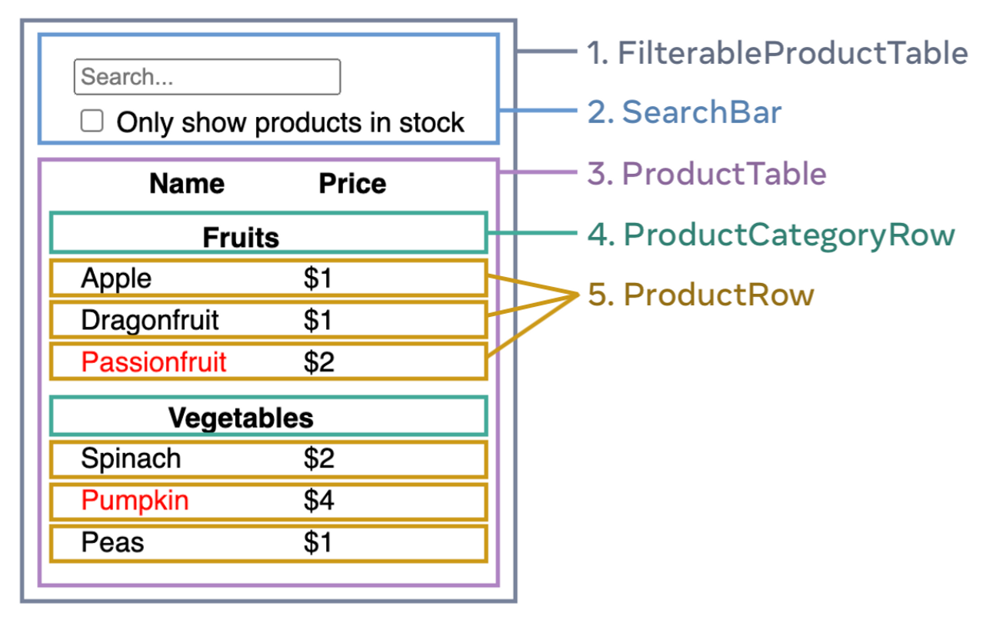

# 3. React로 사고하기

React는 디자인을 바라보는 방식과 앱을 빌드하는 방식을 바꿀 수 있습니다. React로 사용자 인터페이스를 빌드할 때는 먼저 *컴포넌트*라고 하는 조각으로 분해합니다. 그런 다음 각 컴포넌트에 대해 서로 다른 시각적 상태를 기술합니다. 마지막으로 컴포넌트를 서로 연결해 데이터가 흐르도록 합니다. 이 튜토리얼에서는 React로 검색 가능한 제품 데이터 테이블을 구축하는 사고 과정을 안내합니다.

## Start with the mockup : mockup으로 시작하기

이미 JSON API와 디자이너의 목업이 있다고 가정해 보겠습니다.

JSON API는 다음과 같은 데이터를 반환합니다:

```javascript
[
  { category: 'Fruits', price: '$1', stocked: true, name: 'Apple' },
  { category: 'Fruits', price: '$1', stocked: true, name: 'Dragonfruit' },
  { category: 'Fruits', price: '$2', stocked: false, name: 'Passionfruit' },
  { category: 'Vegetables', price: '$2', stocked: true, name: 'Spinach' },
  { category: 'Vegetables', price: '$4', stocked: false, name: 'Pumpkin' },
  { category: 'Vegetables', price: '$1', stocked: true, name: 'Peas' },
];
```

React에서 UI를 구현하려면 일반적으로 동일한 5단계를 따릅니다.

## Step 1: Break the UI into a component hierarchy : UI를 컴포넌트 계층 구조로 나누기

먼저 목업의 모든 컴포넌트와 하위 컴포넌트 주위에 상자를 그리고 이름을 지정합니다. 디자이너와 함께 작업하는 경우 디자이너가 디자인 도구에서 이러한 컴포넌트의 이름을 이미 지정했을 수 있습니다. 디자이너에게 물어보세요!

배경에 따라 디자인을 여러 가지 방식으로 컴포넌트로 분할하는 것을 생각해 볼 수 있습니다:

- **프로그래밍** - 새 함수나 객체를 생성할지 여부를 결정할 때 동일한 기법을 사용합니다. 이러한 기법 중 하나는 [단일 책임 원칙](https://en.wikipedia.org/wiki/Single_responsibility_principle)으로, 컴포넌트는 이상적으로는 한 가지 일만 수행해야 한다는 것입니다. 만약 컴포넌트가 늘어나게 되면 더 작은 하위 컴포넌트로 분해해야 합니다.
- **CSS** - 클래스 선택자를 만들 때 무엇을 위해 만들 것인지 생각해 보세요. (단, 컴포넌트는 조금 덜 세분화되어 있습니다.)
- **디자인** - 디자인의 레이어를 어떻게 구성할지 고려하세요.

JSON이 잘 구조화되어 있으면 UI의 컴포넌트 구조에 자연스럽게 매핑되는 것을 종종 발견할 수 있습니다. 이는 UI와 데이터 모델이 동일한 정보 아키텍처, 즉 동일한 형태를 가지고 있는 경우가 많기 때문입니다. UI를 컴포넌트로 분리하면 각 컴포넌트가 데이터 모델의 한 부분과 일치합니다.


이 화면에는 5개의 컴포넌트가 있습니다:

1.  `FilterableProductTable` (회색)에는 전체 앱이 포함됩니다.
2.  `SearchBar` (파란색)는 사용자 입력을 수신합니다.
3.  `ProductTable` (보라색)은 사용자 입력에 따라 목록을 표시하고 필터링합니다.
4.  `ProductCategoryRow` (녹색)는 각 카테고리에 대한 제목을 표시합니다.
5.  `ProductRow` (노란색)는 각 상품에 대한 행을 표시합니다.

`ProductTable`(보라색)을 보면 테이블 헤더("Name" 및 "Price" 레이블 포함)가 자체 컴포넌트가 아님을 알 수 있습니다. 이것은 선호도의 문제이며 어느 쪽이든 사용할 수 있습니다. 이 예제에서는 `ProductTable`의 목록 안에 표시되므로 `ProductTable`의 일부입니다. 그러나 이 헤더가 복잡해지면(예: 정렬을 추가하는 경우) 이를 별도의 `ProductTableHeader `컴포넌트로 이동할 수 있습니다.

이제 목업에서 컴포넌트를 식별했으므로 계층 구조로 정렬합니다. 목업의 다른 컴포넌트 안에 있는 컴포넌트는 계층 구조에서 하위로 나타나야 합니다:

- `FilterableProductTable`
  - `SearchBar`
  - `ProductTable`
    - `ProductCategoryRow`
    - `ProductRow`

## Step 2: Build a static version in React : React로 정적인 UI 만들기

컴포넌트 계층 구조가 완성되었으니 이제 앱을 구현할 차례입니다. 가장 간단한 접근은 상호작용을 추가하지 않고 데이터 모델에서 UI를 렌더링하는 버전을 만드는 것입니다! 정적 버전을 먼저 만든 다음 상호작용을 별도로 추가하는 것이 더 쉬운 경우가 많습니다. 정적 버전을 만드는 데엔 타이핑이 많이 필요하지만 고민은 크게 필요하지 않은 반면, 상호작용을 추가할 때엔 타이핑보다 고민이 많이 필요합니다.

데이터 모델을 렌더링하는 앱의 정적 버전을 만들기 위해서는 다른 컴포넌트를 재사용하는 [components](https://roy-jung.notion.site/1-1-Your-First-Component-f189e33f924f4d0a90cbac757e66342e)를 만들고 [props](https://roy-jung.notion.site/1-5-props-Passing-Props-to-a-Component-dc56004c6650462b9e98d49d7d387eff)를 사용하여 데이터를 전달해야 합니다. props는 부모에서 자식으로 데이터를 전달하는 방식입니다. ([state](https://roy-jung.notion.site/2-2-State-State-A-Component-s-Memory-2b87b53046e14485883b0bf8036311f6)의 개념에 익숙하더라도 이 정적 버전을 빌드할 때에는 state를 아예 사용하지 마세요. state는 상호작용, 즉 시간이 지남에 따라 변하는 데이터에만 사용됩니다. 이 앱은 정적 버전이므로 필요하지 않습니다.)

계층 구조에서 상위 컴포넌트부터 '하향식'(예: `FilterableProductTable`)으로 만들거나, 하위 컴포넌트부터 '상향식'(예: `ProductRow`)으로 만들 수 있습니다. 보통 간단한 예시에서는 하향식으로 진행하는 것이 더 쉽고, 대규모 프로젝트에서는 상향식으로 진행하는 것이 더 쉽습니다.

```javascript
function ProductCategoryRow({ category }) {
  return (
    <tr>
      <th colSpan='2'>{category}</th>
    </tr>
  );
}

function ProductRow({ product }) {
  const name = product.stocked ? (
    product.name
  ) : (
    <span style={{ color: 'red' }}>{product.name}</span>
  );

  return (
    <tr>
      <td>{name}</td>
      <td>{product.price}</td>
    </tr>
  );
}

function ProductTable({ products }) {
  const rows = [];
  let lastCategory = null;

  products.forEach((product) => {
    if (product.category !== lastCategory) {
      rows.push(
        <ProductCategoryRow
          category={product.category}
          key={product.category}
        />
      );
    }
    rows.push(<ProductRow product={product} key={product.name} />);
    lastCategory = product.category;
  });

  return (
    <table>
      <thead>
        <tr>
          <th>Name</th>
          <th>Price</th>
        </tr>
      </thead>
      <tbody>{rows}</tbody>
    </table>
  );
}

function SearchBar() {
  return (
    <form>
      <input type='text' placeholder='Search...' />
      <label>
        <input type='checkbox' /> Only show products in stock
      </label>
    </form>
  );
}

function FilterableProductTable({ products }) {
  return (
    <div>
      <SearchBar />
      <ProductTable products={products} />
    </div>
  );
}

const PRODUCTS = [
  { category: 'Fruits', price: '$1', stocked: true, name: 'Apple' },
  { category: 'Fruits', price: '$1', stocked: true, name: 'Dragonfruit' },
  { category: 'Fruits', price: '$2', stocked: false, name: 'Passionfruit' },
  { category: 'Vegetables', price: '$2', stocked: true, name: 'Spinach' },
  { category: 'Vegetables', price: '$4', stocked: false, name: 'Pumpkin' },
  { category: 'Vegetables', price: '$1', stocked: true, name: 'Peas' },
];

export default function App() {
  return <FilterableProductTable products={PRODUCTS} />;
}
```

컴포넌트를 만들고 나면 데이터 모델을 렌더링하는 재사용 가능한 컴포넌트 라이브러리를 갖게 됩니다. 이 앱은 정적 앱이므로 컴포넌트는 JSX만 반환합니다. 계층 구조의 맨 위에 있는 컴포넌트(`FilterableProductTable`)는 데이터 모델을 prop으로 사용합니다. 데이터가 최상위 컴포넌트에서 트리 하단에 있는 컴포넌트로 흘러내리기 때문에 이를 *단방향 데이터 흐름*이라고 합니다.

## Step 3: Find the minimal but complete representation of UI state : 최소한의 완전한 UI state 찾기

UI를 상호작용하게 만들려면 사용자가 기반이 되는 데이터 모델을 변경할 수 있도록 해야 합니다. 이를 위해 state를 사용합니다.

state를 앱이 기억해야 하는 최소한의 변화하는 데이터 집합으로 생각하세요. state를 구조화할 때 가장 중요한 원칙은 [DRY(반복하지 않기)](https://en.wikipedia.org/wiki/Don%27t_repeat_yourself)를 유지하는 것입니다. 애플리케이션에 필요한 최소한의 state를 파악하고 그 외의 모든 것을 필요할 때 계산하세요. 예를 들어 쇼핑 목록을 작성하는 경우 항목을 state 배열로 저장할 수 있습니다. 목록에 있는 항목의 개수도 표시하려면 항목의 개수를 다른 state 값으로 저장하는 대신 배열의 길이를 읽으면 됩니다.

이제 이 예제 애플리케이션의 모든 데이터 조각을 생각해 보세요:

1.  제품의 원본 목록
2.  사용자가 입력한 검색어
3.  체크박스의 값
4.  필터링된 제품 목록

다음 중 어떤 것이 state인가요? 그렇지 않은 것을 식별합니다:

- 시간이 지나도 **변하지 않나요**? 그렇다면 state가 아닙니다.
- **부모로부터** props를 통해 **전달**되나요? 그렇다면 state가 아닙니다.
- 컴포넌트의 기존 state 또는 props를 가지고 **계산할 수 있나요**? 그렇다면 _당연히_ state가 아닙니다!

남은 것은 아마도 state일 것입니다.

다시 한 번 하나씩 살펴봅시다:

1.  제품 원본 목록은 **props로 전달되었으므로 state가 아닙니다**.
2.  검색어는 시간에 따라 바뀌고 다른 것으로부터 계산할 수 없으므로 state로 볼 수 있습니다.
3.  체크박스의 값은 시간에 따라 바뀌고 다른 것으로부터 계산할 수 없으므로 state로 볼 수 있습니다.
4.  필터링된 제품 목록은 **원본 목록으로부터 검색어 및 체크박스 값을 조합하여 계산할 수 있으므로 state가 아닙니다**.

즉, 검색어와 체크박스의 값만 state입니다!

**[DEEP DIVE] Props vs State**  
React에는 props와 state라는 두 유형의 데이터 "모델"이 있습니다. 둘은 매우 다릅니다:

- [Props는 함수가 전달받는 인자](https://www.notion.so/1-5-props-Passing-Props-to-a-Component-dc56004c6650462b9e98d49d7d387eff)와 같습니다. 부모 컴포넌트가 자식 컴포넌트에 데이터를 넘겨서 자식의 외관을 커스터마이징할 수 있게 해줍니다. 예를 들어 `Form`은 `color` prop을 `Button`에 전달할 수 있습니다.
- [State는 컴포넌트의 메모리와 같습니다.](https://www.notion.so/2b87b53046e14485883b0bf8036311f6) state는 컴포넌트가 일부 정보를 계속 추적하고 상호작용하여 변화할 수 있게 해줍니다. 예를 들어, `Button`은 `isHovered` state를 추적할 것입니다.

props와 state는 서로 다르지만 함께 동작합니다. 부모 컴포넌트는 종종 일부 정보를 (변경할
수 있도록) state에 보관하고, 이를 자식 컴포넌트에 props로 내려보냅니다. 처음 읽었을 때 그 차이가 모호하게 느껴지더라도 괜찮습니다. 실제로 적용하려면 약간의 연습이 필요할 거예요!

## Step 4: Identify where your state should live : state가 어디에 있어야 할지 파악하기

앱에서 최소한으로 필요한 state 데이터를 식별한 후에는, 이 state를 변경하는 데 책임이 있는 컴포넌트, 즉 state를 '소유'하는 컴포넌트를 식별해야 합니다. 기억하세요: React는 컴포넌트 계층 구조를 따라 부모 컴포넌트에서 자식 컴포넌트로, 아래로 내려가는 단방향 데이터 흐름을 따릅니다. 당장은 어떤 컴포넌트가 state를 가져야 하는지가 명확하지 않을 수도 있습니다. 이 개념을 처음 접하는 경우 어려울 수 있지만, 다음 과정을 따라가면 이해할 수 있을 거예요!

애플리케이션의 각 state에 대해:

1. 해당 state를 기반으로 렌더링하는 _모든_ 컴포넌트를 찾으세요.
2. 가장 가까운 공통 상위 컴포넌트, 즉 계층상 그 state의 영향을 받는 모든 컴포넌트들의 위에 있는 컴포넌트를 찾으세요.
3. state가 어디에 위치할지 결정합시다:  
   a. 대개 공통 부모에 state를 그대로 둘 수 있습니다.  
   b. 혹은 공통 부모보다 더 상위 컴포넌트에 state를 둘 수도 있습니다.  
   c. state를 소유할 적절한 컴포넌트를 찾지 못했다면, state를 소유하는 새 컴포넌트를 만들어 공통 부모 컴포넌트보다 상위에 추가하세요.

이전 단계에서는 이 애플리케이션에서 검색어와 체크박스 값이라는 두 state 조각을 발견했습니다. 이 예제에서는 이들이 항상 함께 등장하므로, 이들을 같은 위치에 두는 것이 이치에 맞습니다.

이제 이 state에 대한 전략을 적용해 봅시다:

1. **state를 사용하는 컴포넌트들 식별하기:**
   - `ProductTable`은 해당 state(검색어 및 체크박스 값)를 기반으로 제품 목록을 필터링해야 합니다.
   - `SearchBar`는 해당 state(검색어 및 체크박스 값)를 표시해야 합니다.
2. **공통 부모 찾기:** 두 컴포넌트가 공유하는 첫 번째 부모 컴포넌트는 `FilterableProductTable`입니다.
3. **state를 어디에 둘지 결정하기:** `FilterableProductTable`에 filter text와 checked state 값을 유지합니다.

이제 state 값은 `FilterableProductTable`에 있습니다.

[useState() Hook](https://roy-jung.notion.site/useState-35d982e6f31144afb9a6f60d9c419d6f)으로 컴포넌트에 state를 추가합니다. Hook은 React에 "끼어들게(hook into)" 해주는 특수한 함수입니다. `FilterableProductTable`의 윗부분에 두 개의 state 변수를 추가하고 애플리케이션의 초기 state를 지정하세요:

```javascript
function FilterableProductTable({ products }) {
  const [filterText, setFilterText] = useState('');
  const [inStockOnly, setInStockOnly] = useState(false);
  //...
}
```

그런 다음 `filterText`와 `inStockOnly`를 `ProductTable`과 `SearchBar`에 props로 전달하세요:

```javascript
<div>
  <SearchBar filterText={filterText} inStockOnly={inStockOnly} />
  <ProductTable
    products={products}
    filterText={filterText}
    inStockOnly={inStockOnly}
  />
</div>
```

이제 애플리케이션이 어떻게 동작하는지 확인할 수 있습니다. `filterText` 초기 값을 `useState('')`에서 `useState('fruit')`로 수정해 보세요. 검색어(fruit)와 데이터 테이블이 모두 업데이트될 것입니다:

```javascript
import { useState } from 'react';

function FilterableProductTable({ products }) {
  const [filterText, setFilterText] = useState('');
  const [inStockOnly, setInStockOnly] = useState(false);

  return (
    <div>
      <SearchBar filterText={filterText} inStockOnly={inStockOnly} />
      <ProductTable
        products={products}
        filterText={filterText}
        inStockOnly={inStockOnly}
      />
    </div>
  );
}

function ProductCategoryRow({ category }) {
  return (
    <tr>
      <th colSpan='2'>{category}</th>
    </tr>
  );
}

function ProductRow({ product }) {
  const name = product.stocked ? (
    product.name
  ) : (
    <span style={{ color: 'red' }}>{product.name}</span>
  );

  return (
    <tr>
      <td>{name}</td>
      <td>{product.price}</td>
    </tr>
  );
}

function ProductTable({ products, filterText, inStockOnly }) {
  const rows = [];
  let lastCategory = null;

  products.forEach((product) => {
    if (product.name.toLowerCase().indexOf(filterText.toLowerCase()) === -1) {
      return;
    }
    if (inStockOnly && !product.stocked) {
      return;
    }
    if (product.category !== lastCategory) {
      rows.push(
        <ProductCategoryRow
          category={product.category}
          key={product.category}
        />
      );
    }
    rows.push(<ProductRow product={product} key={product.name} />);
    lastCategory = product.category;
  });

  return (
    <table>
      <thead>
        <tr>
          <th>Name</th>
          <th>Price</th>
        </tr>
      </thead>
      <tbody>{rows}</tbody>
    </table>
  );
}

function SearchBar({ filterText, inStockOnly }) {
  return (
    <form>
      <input type='text' value={filterText} placeholder='Search...' />
      <label>
        <input type='checkbox' checked={inStockOnly} /> Only show products in
        stock
      </label>
    </form>
  );
}

const PRODUCTS = [
  { category: 'Fruits', price: '$1', stocked: true, name: 'Apple' },
  { category: 'Fruits', price: '$1', stocked: true, name: 'Dragonfruit' },
  { category: 'Fruits', price: '$2', stocked: false, name: 'Passionfruit' },
  { category: 'Vegetables', price: '$2', stocked: true, name: 'Spinach' },
  { category: 'Vegetables', price: '$4', stocked: false, name: 'Pumpkin' },
  { category: 'Vegetables', price: '$1', stocked: true, name: 'Peas' },
];

export default function App() {
  return <FilterableProductTable products={PRODUCTS} />;
}
```

Form 편집은 아직 작동하지 않습니다. 위의 코드에서 콘솔 오류가 발생하는 이유를 설명하고 있습니다:

> `onChange` 핸들러가 없는 form 필드에 `value` prop을 제공했습니다. 이렇게 하면 읽기 전용 필드가 렌더링됩니다.

위의 코드에서 `ProductTable`과 `SearchBar`는 `filterText`와 `inStockOnly` prop을 읽어 테이블, 인풋 및 체크박스를 렌더링합니다. 예를 들어 다음은 `SearchBar`가 입력 값을 채우는 방식입니다:

```javascript
function SearchBar({ filterText, inStockOnly }) {
  return (
    <form>
      <input
        type="text"
        value={filterText}
        placeholder="Search..."/>
```

하지만 아직 타이핑과 같은 사용자 액션에 응답하는 코드를 추가하지 않았습니다. 이것이 마지막 단계가 될 것입니다.

## Step 5: Add inverse data flow : 역방향 데이터 흐름 추가하기

현재 앱은 props와 state가 계층 구조 아래로 흐르면서 올바르게 렌더링됩니다. 하지만 사용자 입력에 따라 state를 변경하려면 계층 구조상 깊은 곳에 있는 폼 컴포넌트가 높은 곳에 있는 `FilterableProductTable`의 state를 업데이트해야 하므로, 역방향으로도 데이터가 흐를 수 있게 해야 합니다.

React의 데이터 흐름은 명쾌하지만, 양방향 데이터 바인딩보다는 약간 더 많은 타이핑이 필요합니다. 위의 예시에서 검색어를 입력하거나 체크박스를 선택하면 React가 이를 무시하는 것을 확인할 수 있습니다. 이것은 의도된 동작입니다. `<input value={filterText} />`를 작성함으로써 `input`의 `value` 프로퍼티가 항상 `FilterableProductTable`에서 전달된 `filterText` state와 같도록 했기 때문입니다. `filterText` state가 절대 변경되지 않으므로 검색어 역시 변하지 않는 것이죠.

우리는 사용자가 form 입력을 변경할 때마다 변경 사항을 반영하도록 state도 업데이트하기를 바랍니다. 이 state는 `FilterableProductTable`이 가지고 있으므로 이 컴포넌트만이 `setFilterText` 및 `setInStockOnly`를 호출할 수 있습니다. 하위에 있는 SearchBar가 상위에 있는 `FilterableProductTable`의 state를 대신 업데이트할 수 있도록 하려면, 이 함수들을 `SearchBar`에 전달해야 합니다:

```javascript
function FilterableProductTable({ products }) {
  const [filterText, setFilterText] = useState('');
  const [inStockOnly, setInStockOnly] = useState(false);

  return (
    <div>
      <SearchBar
        filterText={filterText}
        inStockOnly={inStockOnly}
        onFilterTextChange={setFilterText}
        onInStockOnlyChange={setInStockOnly} />
```

`SearchBar` 안에 `onChange` 이벤트 핸들러를 추가하고 이 핸들러에서 부모 state를 변경하도록 합시다:

```javascript
<input
  type='text'
  value={filterText}
  placeholder='Search...'
  onChange={(e) => onFilterTextChange(e.target.value)}
/>
```

이제 애플리케이션이 완전히 작동합니다!

```javascript
import { useState } from 'react';

function FilterableProductTable({ products }) {
  const [filterText, setFilterText] = useState('');
  const [inStockOnly, setInStockOnly] = useState(false);

  return (
    <div>
      <SearchBar
        filterText={filterText}
        inStockOnly={inStockOnly}
        onFilterTextChange={setFilterText}
        onInStockOnlyChange={setInStockOnly}
      />
      <ProductTable
        products={products}
        filterText={filterText}
        inStockOnly={inStockOnly}
      />
    </div>
  );
}

function ProductCategoryRow({ category }) {
  return (
    <tr>
      <th colSpan='2'>{category}</th>
    </tr>
  );
}

function ProductRow({ product }) {
  const name = product.stocked ? (
    product.name
  ) : (
    <span style={{ color: 'red' }}>{product.name}</span>
  );

  return (
    <tr>
      <td>{name}</td>
      <td>{product.price}</td>
    </tr>
  );
}

function ProductTable({ products, filterText, inStockOnly }) {
  const rows = [];
  let lastCategory = null;

  products.forEach((product) => {
    if (product.name.toLowerCase().indexOf(filterText.toLowerCase()) === -1) {
      return;
    }
    if (inStockOnly && !product.stocked) {
      return;
    }
    if (product.category !== lastCategory) {
      rows.push(
        <ProductCategoryRow
          category={product.category}
          key={product.category}
        />
      );
    }
    rows.push(<ProductRow product={product} key={product.name} />);
    lastCategory = product.category;
  });

  return (
    <table>
      <thead>
        <tr>
          <th>Name</th>
          <th>Price</th>
        </tr>
      </thead>
      <tbody>{rows}</tbody>
    </table>
  );
}

function SearchBar({
  filterText,
  inStockOnly,
  onFilterTextChange,
  onInStockOnlyChange,
}) {
  return (
    <form>
      <input
        type='text'
        value={filterText}
        placeholder='Search...'
        onChange={(e) => onFilterTextChange(e.target.value)}
      />
      <label>
        <input
          type='checkbox'
          checked={inStockOnly}
          onChange={(e) => onInStockOnlyChange(e.target.checked)}
        />{' '}
        Only show products in stock
      </label>
    </form>
  );
}

const PRODUCTS = [
  { category: 'Fruits', price: '$1', stocked: true, name: 'Apple' },
  { category: 'Fruits', price: '$1', stocked: true, name: 'Dragonfruit' },
  { category: 'Fruits', price: '$2', stocked: false, name: 'Passionfruit' },
  { category: 'Vegetables', price: '$2', stocked: true, name: 'Spinach' },
  { category: 'Vegetables', price: '$4', stocked: false, name: 'Pumpkin' },
  { category: 'Vegetables', price: '$1', stocked: true, name: 'Peas' },
];

export default function App() {
  return <FilterableProductTable products={PRODUCTS} />;
}
```

이벤트 처리 및 state 업데이트에 대한 보다 자세한 내용은 [상호작용 추가하기](https://roy-jung.notion.site/2-Adding-Interactivity-6e582d5ca8274871ba10698db8681d17) 섹션에서 확인할 수 있습니다.

## Where to go from here : 이제 어디로 갈까요?

지금까지 React로 컴포넌트와 애플리케이션을 구축하는 방법에 대해 아주 간략하게 소개했습니다. 지금 바로 [React 프로젝트를 시작](https://roy-jung.notion.site/4-1-Start-a-New-React-Project-d0f4518b230f4c949ee5206b75efa956)해도 좋고, 이 자습서에서 사용된 [모든 구문을 더 자세히 살펴볼](https://roy-jung.notion.site/1-Describing-the-UI-7abe8cdee66d424299659d4cca438895) 수도 있습니다.
