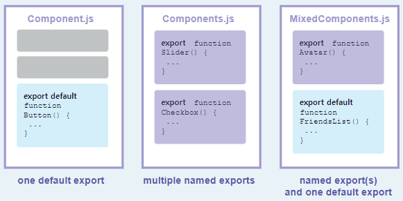

# 1-2. 컴포넌트 import 및 export

컴포넌트의 가장 큰 장점은 재사용성으로 컴포넌트를 조합해 또 다른 컴포넌트를 만들 수 있습니다. 컴포넌트를 여러 번 중첩하게 되면 다른 파일로 분리해야 하는 시점이 생깁니다. 이렇게 분리하면 나중에 파일을 찾기 더 쉽고 재사용하기 편리해집니다.

> **학습 내용**
>
> - 루트 컴포넌트란 무엇인지
> - 컴포넌트를 import하고 export하는 방법
> - default 및 이름 있는 import / export 를 사용해야 하는 경우
> - 하나의 파일에서 여러 컴포넌트를 import / export 하는 방법
> - 컴포넌트를 여러 파일로 분할하는 방법

## The root component file

[첫번째 컴포넌트](https://www.notion.so/f189e33f924f4d0a90cbac757e66342e)에서 만든 `Profile` 컴포넌트와 `Gallery` 컴포넌트는 아래와 같이 렌더링 됩니다:

```javascript
function Profile() {
  return ;
}

export default function Gallery() {
  return (
    <section>
      <h1>Amazing scientists</h1>
      <Profile />
      <Profile />
      <Profile />
    </section>
  );
}
```

이 예제의 컴포넌트들은 모두 `App.js`라는 **root 컴포넌트 파일**에 존재합니다. [Create React App](https://create-react-app.dev/)에서는 앱 전체가 `src/App.js`에서 실행됩니다. 설정에 따라 root 컴포넌트가 다른 파일에 위치할 수도 있습니다. Next.js처럼 파일 기반으로 라우팅하는 프레임워크일 경우 페이지별로 root 컴포넌트가 다를 수 있습니다.

## 컴포넌트 내보내기 및 불러오기

나중에 랜딩 화면을 변경하여 과학 도서 목록을 넣으려면 어떻게 해야 하나요? 아니면 모든 프로필을 다른 곳에 배치하고자 한다면? `Gallery`와 `Profile`을 root 컴포넌트 파일 밖으로 옮기는 것이 좋을 것 같습니다. 이렇게 하면 보다 모듈성이 강화되고 다른 파일에서 재사용할 수 있게 됩니다. 컴포넌트는 다음 세 단계로 이동할 수 있습니다.

1.  컴포넌트를 넣을 JS 파일을 **생성**합니다.
2.  새로 만든 파일에서 함수 컴포넌트를 **export** 합니다. ([default](https://developer.mozilla.org/docs/Web/JavaScript/Reference/Statements/export#using_the_default_export) 또는 [named export](https://developer.mozilla.org/docs/Web/JavaScript/Reference/Statements/export#using_named_exports) 방식을 사용합니다.)
3.  컴포넌트를 사용할 파일에서 **import** 합니다. ([default](https://developer.mozilla.org/docs/Web/JavaScript/Reference/Statements/import#importing_defaults) 또는 [named](https://developer.mozilla.org/docs/Web/JavaScript/Reference/Statements/import#import_a_single_export_from_a_module) export에 대응하는 방식으로 import 합니다.)

여기서 `Profile`과 `Gallery`는 모두 `App.js`에서 `Gallery.js`라는 새 파일로 이동했습니다. 이제 `App.js`를 변경하여 `Gallery.js`에서 `Gallery`를 import할 수 있습니다:

```javascript
import Gallery from "./Gallery.js";

export default function App() {
  return <Gallery />;
}
```

이제 이 예제에서는 컴포넌트들이 두 파일로 나뉘게 되었습니다:

1.  `Gallery.js`:
    - 동일한 파일 내에서만 사용되며 export하지 않는 `Profile` 컴포넌트를 정의합니다.
    - `Gallery` 컴포넌트를 **default export** 방식으로 export 합니다.
2.  `App.js`:
    - `Gallery`를 `Gallery.js`로부터 **default import** 방식으로 import 합니다.
    - root `App` 컴포넌트를 **default export** 방식으로 **export** 합니다.

> **Note**
>
> 가끔 `.js`와 같은 파일 확장자가 없는 때도 있습니다.

```jsx
import Gallery from "./Gallery";
```

> React에서는 `'./Gallery.js'` 또는 `'./Gallery'` 둘 다 사용할 수 있지만 전자의 경우가 [ES Modules](https://developer.mozilla.org/docs/Web/JavaScript/Guide/Modules) 사용 방법에 더 가깝습니다.

**[DEEP DIVE] Default vs named exports**
보통 JavaScript에서는 default export와 named export라는 두 가지 방법으로 값을 export 합니다. 지금까지의 예제에서는 default export만 사용했지만 두 방법 다 한 파일에서 사용할 수도 있습니다. **다만 한 파일에서는 하나의 _default_ export만 존재할 수 있고 _named_ export는 여러 개가 존재할 수 있습니다.**



Export 하는 방식에 따라 import 하는 방식이 정해집니다. Default export로 한 값을 named import로 가져오려고 하려면 에러가 발생합니다. 아래 표에는 각각의 경우의 문법이 정리되어 있습니다.

| Syntax  | Export statement                      | Import statement                        |
| ------- | ------------------------------------- | --------------------------------------- |
| Default | `export default function Button() {}` | `import Button from './button.js';`     |
| Named   | `export function Button() {}`         | `import { Button } from './button.js';` |

_default_ import를 사용하는 경우 원한다면 `import` 단어 후에 다른 이름으로 값을 가져올 수 있습니다. 예를 들어 `import Banana from './button.js'` 라고 쓰더라도 같은 default export 값을 가져오게 됩니다. 반대로 named import를 사용할 때는 양쪽 파일에서 사용하고자 하는 값의 이름이 같아야 해서 _named_ import라고 불립니다

**보편적으로 한 파일에서 하나의 컴포넌트만 export 할 때 default export 방식을 사용하고 여러 컴포넌트를 export 할 경우엔 named export 방식을 사용합니다.** 어떤 방식을 사용하든 컴포넌트와 파일의 이름을 의미 있게 명명하는 것은 중요합니다. `export default () => {}` 처럼 이름 없는 컴포넌트는 나중에 디버깅하기 어렵기 때문에 권장하지 않습니다.

## 동일한 파일에서 여러 컴포넌트 내보내기 및 가져오기

갤러리 대신 하나의 `Profile`만 표시하고 싶다면 어떻게 해야 하나요? `Profile` 컴포넌트도 export 할 수 있습니다. 하지만 `Gallery.js`에는 이미 _default_ export가 있으며, default export를 _두 개_ 가질 수는 없습니다. 새 파일을 만들어 default export 하거나, 혹은`Profile`에서 _named_ export를 추가할 수도도 있습니다. **한 파일은 default export를 하나만 가질 수 있지만, named export는 여러 개 가질 수 있습니다!**

> **Note**  
> default export와 named export 사이의 잠재적인 혼동을 줄이기 위해 일부 팀에서는 한 가지 스타일(default 또는 named)만 고수하거나, 단일 파일 내에서 혼합하지 않도록 선택합니다. 자신에게 가장 적합한 방식을 선택하세요!

먼저 named export 방식을 사용해서 `Gallery.js` 파일에서 `Profile` 컴포넌트를 **export** 합니다. (`default` 키워드를 사용하지 않습니다):

```javascript
export function Profile() {
  // ...
}
```

그 다음엔 named import 방식으로 `Gallery.js` 파일에서 `Profile` 컴포넌트를 `App.js` 파일로 **import** 합니다. (중괄호를 사용합니다)

```javascript
import { Profile } from "./Gallery.js";
```

마지막으로 `<Profile />`을 `App` 컴포넌트에서 **렌더링**합니다.

```javascript
export default function App() {
  return <Profile />;
}
```

이제 `Gallery.js`에는 default `Gallery` export와 named `Profile` export라는 두 가지의 export가 존재합니다. `App.js`에서는 두 컴포넌트를 import 해서 사용합니다.

```javascript
import Gallery from "./Gallery.js";
import { Profile } from "./Gallery.js";

export default function App() {
  return <Profile />;
}
```

이제 default와 named export 방식 둘 다 사용할 수 있게 됐습니다:

- `Gallery.js`:
  - `Profile` 컴포넌트를 `Profile`이라는 이름으로 **named export** 합니다.
  - `Gallery` 컴포넌트를 **default export** 합니다.
- `App.js`:
  - `Gallery.js`에서 `Profile` 컴포넌트를 `Profile`이라는 이름으로 **named import** 합니다.
  - `Gallery.js`에서 `Gallery` 컴포넌트를 **default import** 합니다.
  - root `App` 컴포넌트를 **default export** 합니다.

## Recap

이 페이지에서 배우게 된 것들입니다:

- Root 컴포넌트란 무엇인지
- 컴포넌트를 import 하거나 export 하는 방법
- 언제, 어떻게 default 및 named import, default 및 named export를 사용하는지
- 한 파일에서 여러 컴포넌트를 export 하는 방법
