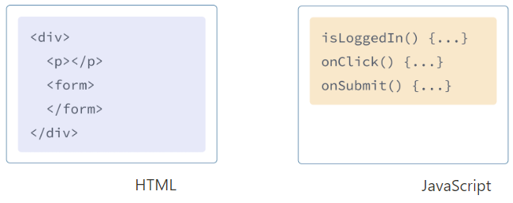
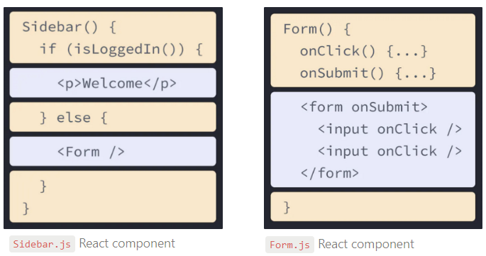

# 1-3. JSX로 마크업 작성하기

JSX는 JavaScript를 확장한 문법으로, JavaScript 파일 안에 HTML과 유사한 마크업을 작성할 수 있도록 해줍니다. 컴포넌트를 작성하는 다른 방법도 있지만, 대부분의 React개발자는 JSX의 간결함을 선호하며 대부분의 코드베이스에서 JSX를 사용합니다.

> **학습 내용**
>
> - React가 마크업과 렌더링 로직을 같이 사용하는 이유
> - JSX와 HTML의 차이점
> - JSX로 정보를 보여주는 방법

## JSX: JavaScript에 마크업 넣기

웹은 HTML, CSS, JavaScript를 기반으로 만들어져왔습니다. 수년 동안 웹 개발자들은 HTML로 컨텐츠를, CSS로 디자인을, 로직은 JavaScript로 작성해왔습니다. 보통은 각각 분리된 파일로 관리를 합니다! 페이지의 로직이 JavaScript안에서 분리되어 동작하는 동안, HTML 안에서는 컨텐츠가 마크업 되었습니다.



하지만 웹이 더욱 인터랙티브해지면서 로직이 컨텐츠를 결정하는 경우가 많아졌습니다. 그래서 JavaScript가 HTML을 담당하게 되었죠! 이것이 **바로 React에서 렌더링 로직과 마크업이 같은 위치의 컴포넌트에 함께 있는 이유입니다.**



버튼의 렌더링 로직과 마크업이 함께 존재한다면 모든 편집에서 서로 동기화 상태를 유지할 수 있습니다. 반대로 버튼의 마크업과 사이드바의 마크업처럼 서로 관련이 없는 항목들은 서로 분리되어 있으므로 각각 개별적으로 변경하는 것이 더 안전합니다.

각 React 컴포넌트는 React가 브라우저에 마크업을 렌더링할 수 있는 JavaScript 함수입니다. React 컴포넌트는 JSX라는 구문 확장자를 사용하여 해당되는 마크업을 표현합니다. JSX는 HTML과 비슷해보이지만 조금 더 엄격하며 동적으로 정보를 표시할 수 있습니다. JSX를 이해하는 가장 좋은 방법은 일부의 HTML마크업을 JSX마크업으로 변환해보는 것입니다.

> **Note**  
> JSX와 React는 서로 다른 별개의 개념입니다. 종종 함께 사용되기도 하지만 [독립적으로 사용](https://reactjs.org/blog/2020/09/22/introducing-the-new-jsx-transform.html#whats-a-jsx-transform)할 수도 _있습니다_. JSX는 구문 확장이고, React는 자바스크립트 라이브러리입니다.

## HTML을 JSX로 변환하기

다음과 같은 (완벽하게 유효한) HTML이 있다고 가정해봅시다:

```HTML
<h1>Hedy Lamarr's Todos</h1>

<ul>
    <li>Invent new traffic lights
    <li>Rehearse a movie scene
    <li>Improve the spectrum technology
</ul>
```

이제 이것을 컴포넌트로 만들어볼 것입니다:

```javascript
export default function TodoList() {
  return (
    // ???
  )
}
```

이 코드를 그대로 복사하여 붙여넣는다면 동작하지 않을 것입니다:

```javascript
export default function TodoList() {
  return (
    // This doesn't quite work!
    <h1>Hedy Lamarr's Todos</h1>
    
    <ul>
      <li>Invent new traffic lights
      <li>Rehearse a movie scene
      <li>Improve the spectrum technology
    </ul>
  );
}
```

왜냐하면 JSX는 HTML보다 더 엄격하며 몇 가지 규칙이 더 있기 때문입니다! 위의 오류메세지를 읽으면 마크업을 수정하도록 안내하거나 아래의 가이드를 따를 수 있습니다.

> **Note**  
> 대부분의 경우 React의 화면 오류 메세지는 문제가 있는 곳을 찾는 데 도움이 됩니다. 막혔을 때 읽어주세요!

## JSX의 규칙

### 1. 하나의 루트 엘리먼트를 반환하세요

컴포넌트에서 여러 엘리먼트를 반환하려면, 하나의 부모 태그로 감싸주세요.

예를 들면 `<div>`를 사용할 수 있습니다:

```JSX
<div>
  <h1>Hedy Lamarr's Todos</h1>
  
  <ul>
    ...
  </ul>
</div>
```

마크업에 `<div>`를 추가하고 싶지 않다면 `<>`와 `</>`를 사용하면 됩니다:

```JSX
<>
  <h1>Hedy Lamarr's Todos</h1>
  
  <ul>
    ...
  </ul>
</>
```

이런 빈 태그를 *[Fragment](https://www.notion.so/88e6945c7db64a55a6dbd48a4a01a3d3)*라고 말합니다. Fragments는 브라우저상의 HTML 트리 구조에서 흔적을 남기지 않고 그룹화해줍니다.

## 2. 모든 태그를 닫으세요

JSX에서는 태그를 명시적으로 닫아야 합니다. ``태그처럼 자체적으로 닫는 태그도 반드시 ``로 작성해야하며, `<li>oranges`와 같은 래핑 태그 역시 `<li>oranges</li>`형태로 작성해야 합니다.

다음과 같이 Hedy Lamarr의 이미지와 리스트의 항목들을 닫아줍니다:

```JSX
<>
  
  <ul>
    <li>Invent new traffic lights</li>
    <li>Rehearse a movie scene</li>
    <li>Improve the spectrum technology</li>
  </ul>
</>
```

3. ~~거의~~ 대부분이 캐멀 케이스입니다!

JSX는 JavaScript로 바뀌고 JSX로 작성된 어트리뷰트는 JavaScript 객체의 키가 됩니다. 종종 컴포넌트 안에서 어트리뷰트를 변수로 읽고 싶은 경우가 있을 것입니다. 하지만 JavaScript에는 변수명에 제한이 있습니다. 예를 들어 변수명에는 대시를 포함하거나 `class`처럼 예약어를 사용할 수 없습니다.

이것이 React에서 많은 HTML과 SVG 어트리뷰트가 캐멀 케이스로 작성되는 이유입니다. 예를 들어 `stroke-width` 대신 `strokeWidth`을 사용합니다. `class`는 예약어이므로, React에서는 대신 [해당 DOM 속성](https://developer.mozilla.org/ko/docs/Web/API/Element/className)의 이름을 따서 `className`을 씁니다:

```JSX

```

[이런 모든 어트리뷰트는 React DOM엘리먼트에서](https://www.notion.so/3820161ff9514e1f868e96a5b702faa7) 찾을 수 있습니다. 틀려도 걱정하지 마세요. React는 [브라우저 콘솔](https://firefox-source-docs.mozilla.org/devtools-user/web_console/index.html)에서 수정 가능한 부분을 메세지로 알려줍니다.

> **Pitfall**  
> 역사적인 이유로 [`aria-*`](https://developer.mozilla.org/ko/docs/Web/Accessibility/ARIA)과 [`data-*`](https://developer.mozilla.org/ko/docs/Learn/HTML/Howto/Use_data_attributes)의 어트리뷰트는 HTML에서와 동일하게 대시를 사용하여 작성합니다.  
> 역사적인 이유?
> [Link](https://stackoverflow.com/questions/52398380/why-react-wai-aria-is-not-in-camelcase/52489695#52489695)  
> **추측**: 아마도 이것은 React 버전 15와 16 사이에 일어난 변경과 관련이 있을 것입니다. 블로그 포스트 "[React 16의 DOM 어트리뷰트](https://reactjs.org/blog/2017/09/08/dom-attributes-in-react-16.html)"에서는 이전에는 제거되었던 사용자 정의 어트리뷰트가 이제 React 16에서 허용된다고 설명합니다. 이 글에서는 어트리뷰트의 내부 화이트리스트가 유지보수 부담이 되어 단순화할 필요가 있다는 우려를 표합니다. 이제 임의의 어트리뷰트를 JSX에 포함할 수 있습니다. 내부적으로 어떻게 작동하는지는 모르겠지만, 내부 화이트리스트의 이야기에서 `aria-*` 속성이 어느 정도 역할을 하는 것으로 생각됩니다. 예를 들어, WAI-ARIA 1.1은 최근 몇 가지 새로운 `aria-*` 어트리뷰트를 도입했고, WAI [개인화 시맨틱 콘텐츠 모듈](https://www.w3.org/TR/personalization-semantics-content-1.0/) 작업 초안에는 `aui-*` 어트리뷰트가 많이 도입되었습니다. 이 두 가지 모두 화이트리스트에 추가해야 했습니다.

### Pro-tip: Use a JSX Converter

기존 마크업에서 모든 어트리뷰트를 변환하는 것은 지루할 수 있습니다. [변환기](https://transform.tools/html-to-jsx)를 사용하여 기존 HTML과 SVG를 JSX로 변환하는 것을 추천합니다. 변환기는 매우 유용하지만 그래도 JSX를 편안하게 작성할 수 있도록 어트리뷰트를 어떻게 쓰는지 이해하는 것도 중요합니다.

최종 결과는 다음과 같습니다:

```javascript
export default function TodoList() {
  return (
    <>
      <h1>Hedy Lamarr's Todos</h1>
      
      <ul>
        <li>Invent new traffic lights</li>
        <li>Rehearse a movie scene</li>
        <li>Improve the spectrum technology</li>
      </ul>
    </>
  );
}
```

## Recap

**요약**

지금까지 JSX가 존재하는 이유와 컴포넌트에서 JSX를 쓰는 방법에 대해 알아보았습니다.

- React 컴포넌트는 서로 관련이 있는 마크업과 렌더링 로직을 함께 그룹화합니다.
- JSX는 HTML과 비슷하지만 몇 가지 차이점이 있습니다. 필요한 경우 [변환기](https://transform.tools/html-to-jsx)를 사용할 수 있습니다.
- 오류 메세지는 종종 마크업을 수정할 수 있도록 올바른 방향을 알려줍니다.
