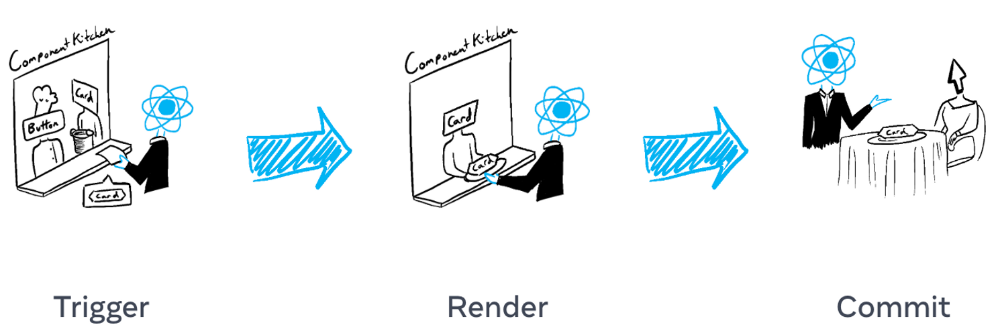

# 2. 상호작용 추가하기

화면의 일부 항목은 사용자 입력에 따라 업데이트됩니다. 예를 들어, 이미지 갤러리를 클릭하면 활성 이미지가 전환됩니다. React에서는 시간이 지남에 따라 변하는 데이터를 *state*라고 합니다. 모든 컴포넌트에 state를 추가하고 필요에 따라 업데이트할 수 있습니다. 이 장에서는 상호작용을 처리하고, state를 업데이트하고, 시간에 따라 다른 출력을 표시하는 컴포넌트를 작성하는 방법을 배웁니다.

## 이벤트에 응답하기

React를 사용하면 JSX에 이벤트 핸들러를 추가할 수 있습니다. 이벤트 핸들러는 클릭, 마우스오버, 양식 입력에 초점 맞추기 등과 같은 사용자 상호작용에 반응하여 트리거되는 자체 함수입니다.

`<button>`과 같은 기본 제공 컴포넌트는 `onClick`과 같은 기본 제공 브라우저 이벤트만 지원합니다. 그러나 자체 컴포넌트를 생성하고 이벤트 핸들러 프롭에 원하는 애플리케이션별 이름을 지정할 수도 있습니다.

```javascript
export default function App() {
  return (
    <Toolbar
      onPlayMovie={() => alert('Playing!')}
      onUploadImage={() => alert('Uploading!')}
    />
  );
}

function Toolbar({ onPlayMovie, onUploadImage }) {
  return (
    <div>
      <Button onClick={onPlayMovie}>Play Movie</Button>
      <Button onClick={onUploadImage}>Upload Image</Button>
    </div>
  );
}

function Button({ onClick, children }) {
  return <button onClick={onClick}>{children}</button>;
}
```

## State: 컴포넌트의 메모리

컴포넌트는 상호 작용의 결과로 화면의 내용을 변경해야 하는 경우가 많습니다. 양식에 입력하면 입력 필드가 업데이트되어야 하고, 이미지 캐러셀에서 '다음'을 클릭하면 표시되는 이미지가 변경되어야 하며, '구매'를 클릭하면 장바구니에 제품이 담겨야 합니다. 컴포넌트는 현재 입력값, 현재 이미지, 장바구니와 같은 것들을 "기억"해야 합니다. React에서는 이런 종류의 컴포넌트별 메모리를 *state*라고 부릅니다.

컴포넌트에 state를 추가하려면 [useState](https://www.notion.so/35d982e6f31144afb9a6f60d9c419d6f) 훅을 사용하면 됩니다. *훅*들은 컴포넌트가 React 기능을 사용할 수 있게 해주는 특수한 함수들입니다(state는 그 기능 중 하나입니다). `useState` 훅을 사용하면 state 변수를 선언할 수 있습니다. 초기 state를 받아 현재 state와 이를 업데이트할 수 있는 state 설정자 함수의 값 쌍을 반환합니다.

```javascript
const [index, setIndex] = useState(0);
const [showMore, setShowMore] = useState(false);
```

이미지 갤러리에서 클릭 시 state를 사용하고 업데이트하는 방법은 다음과 같습니다:

```javascript
import { useState } from 'react';
import { sculptureList } from './data.js';

export default function Gallery() {
  const [index, setIndex] = useState(0);
  const [showMore, setShowMore] = useState(false);

  function handleNextClick() {
    setIndex(index + 1);
  }

  function handleMoreClick() {
    setShowMore(!showMore);
  }

  let sculpture = sculptureList[index];
  return (
    <>
      <button onClick={handleNextClick}>Next</button>
      <h2>
        <i>{sculpture.name} </i>
        by {sculpture.artist}
      </h2>
      <h3>
        ({index + 1} of {sculptureList.length})
      </h3>
      <button onClick={handleMoreClick}>
        {showMore ? 'Hide' : 'Show'} details
      </button>
      {showMore && <p>{sculpture.description}</p>}
      
    </>
  );
}
```

## 렌더링하고 커밋하기

컴포넌트가 화면에 표시되기 전에, 컴포넌트들은 React에서 렌더링해야 합니다. 이 프로세스의 단계를 이해하면 코드가 어떻게 실행되는지 생각하고 그 동작을 설명하는 데 도움이 됩니다.

컴포넌트가 주방에서 재료로 맛있는 요리를 만드는 요리사라고 상상해 보세요. 이 시나리오에서 React는 고객의 요청을 접수하고 주문을 가져오는 웨이터 역할을 합니다. UI를 요청하고 제공하는 이 과정은 세 단계로 이루어집니다:

1.  렌더링 **트리거**(식당의 주문을 주방으로 전달)
2.  컴포넌트 **렌더링**(주방에서 주문 준비)
3.  DOM에 **커밋**(테이블에 주문 배치)



## 스냅샷으로서의 state

일반 자바스크립트 변수와 달리 React state는 스냅샷처럼 동작합니다. state 변수를 설정해도 이미 가지고 있는 state 변수는 변경되지 않고 대신 리렌더링됩니다. 처음에는 놀랄 수 있습니다!

```javascript
console.log(count); // 0
setCount(count + 1); // Request a re-render with 1
console.log(count); // Still 0!
```

React는 이런 식으로 작동하여 미묘한 버그를 피할 수 있습니다. 다음은 간단한 채팅 앱입니다. 먼저 "보내기"를 누른 다음 수신자를 Bob으로 변경하면 어떻게 될지 추측해 보세요. 5초 후 `alert`에 누구의 이름이 나타날까요?

```javascript
import { useState } from 'react';

export default function Form() {
  const [to, setTo] = useState('Alice');
  const [message, setMessage] = useState('Hello');

  function handleSubmit(e) {
    e.preventDefault();
    setTimeout(() => {
      alert(`You said ${message} to ${to}`);
    }, 5000);
  }

  return (
    <form onSubmit={handleSubmit}>
      <label>
        To:{' '}
        <select value={to} onChange={(e) => setTo(e.target.value)}>
          <option value='Alice'>Alice</option>
          <option value='Bob'>Bob</option>
        </select>
      </label>
      <textarea
        placeholder='Message'
        value={message}
        onChange={(e) => setMessage(e.target.value)}
      />
      <button type='submit'>Send</button>
    </form>
  );
}
```

## state 업데이트 큐

이 컴포넌트에는 버그가 있습니다. “+3”을 클릭해도 점수가 1씩 증가합니다.

```javascript
import { useState } from 'react';

export default function Counter() {
  const [score, setScore] = useState(0);

  function increment() {
    setScore(score + 1);
  }

  return (
    <>
      <button onClick={() => increment()}>+1</button>
      <button
        onClick={() => {
          increment();
          increment();
          increment();
        }}
      >
        +3
      </button>
      <h1>Score: {score}</h1>
    </>
  );
}
```

[스냅샷으로서의 state](https://www.notion.so/2-4-state-State-as-a-Snapshot-58da923a84be4ffc8055b113ee1819bc)에서 이런 일이 발생하는 이유를 설명합니다. state를 설정하면 새로운 렌더링을 요청하지만 이미 실행 중인 코드에서는 변경하지 않습니다. 따라서 `setScore(score + 1)`를 호출한 직후에도 `score`는 계속 `0`이 됩니다.

```javascript
console.log(score); // 0
setScore(score + 1); // setScore(0 + 1);
console.log(score); // 0
setScore(score + 1); // setScore(0 + 1);
console.log(score); // 0
setScore(score + 1); // setScore(0 + 1);
console.log(score); // 0
```

state를 설정할 때 *업데이터 함수*를 전달하면 이 문제를 해결할 수 있습니다. `setScore(score + 1)`를 `setScore(s => s + 1)`로 바꾸면 "+3" 버튼이 어떻게 수정되는지 확인해보세요. 여러 state 업데이트를 큐에 넣어야 할 때 유용합니다.

```javascript
import { useState } from 'react';

export default function Counter() {
  const [score, setScore] = useState(0);

  function increment() {
    setScore((s) => s + 1);
  }

  return (
    <>
      <button onClick={() => increment()}>+1</button>
      <button
        onClick={() => {
          increment();
          increment();
          increment();
        }}
      >
        +3
      </button>
      <h1>Score: {score}</h1>
    </>
  );
}
```

## 객체 state 업데이트

state는 객체를 포함한 모든 종류의 자바스크립트 값을 보유할 수 있습니다. 하지만 state에 있는 객체와 배열을 직접 변경해서는 안 됩니다. 대신 객체와 배열을 업데이트하려면 새 객체를 생성하거나 기존 객체의 복사본을 만든 다음 해당 복사본을 사용하도록 state를 업데이트해야 합니다.

일반적으로 `...` 스프레드 구문을 사용하여 변경하려는 객체 및 배열을 복사합니다. 예를 들어 중첩된 객체를 업데이트하는 것은 다음과 같습니다:

```javascript
import { useState } from 'react';

export default function Form() {
  const [person, setPerson] = useState({
    name: 'Niki de Saint Phalle',
    artwork: {
      title: 'Blue Nana',
      city: 'Hamburg',
      image: 'https://i.imgur.com/Sd1AgUOm.jpg',
    },
  });

  function handleNameChange(e) {
    setPerson({
      ...person,
      name: e.target.value,
    });
  }

  function handleTitleChange(e) {
    setPerson({
      ...person,
      artwork: {
        ...person.artwork,
        title: e.target.value,
      },
    });
  }

  function handleCityChange(e) {
    setPerson({
      ...person,
      artwork: {
        ...person.artwork,
        city: e.target.value,
      },
    });
  }

  function handleImageChange(e) {
    setPerson({
      ...person,
      artwork: {
        ...person.artwork,
        image: e.target.value,
      },
    });
  }

  return (
    <>
      <label>
        Name:
        <input value={person.name} onChange={handleNameChange} />
      </label>
      <label>
        Title:
        <input value={person.artwork.title} onChange={handleTitleChange} />
      </label>
      <label>
        City:
        <input value={person.artwork.city} onChange={handleCityChange} />
      </label>
      <label>
        Image:
        <input value={person.artwork.image} onChange={handleImageChange} />
      </label>
      <p>
        <i>{person.artwork.title}</i>
        {' by '}
        {person.name}
        <br />
        (located in {person.artwork.city})
      </p>
      
    </>
  );
}
```

코드에서 객체를 복사하는 것이 지루하다면 [Immer](https://github.com/immerjs/use-immer)와 같은 라이브러리를 사용하여 반복되는 코드를 줄일 수 있습니다:

```javascript
import { useImmer } from 'use-immer';

export default function Form() {
  const [person, updatePerson] = useImmer({
    name: 'Niki de Saint Phalle',
    artwork: {
      title: 'Blue Nana',
      city: 'Hamburg',
      image: 'https://i.imgur.com/Sd1AgUOm.jpg',
    },
  });

  function handleNameChange(e) {
    updatePerson((draft) => {
      draft.name = e.target.value;
    });
  }

  function handleTitleChange(e) {
    updatePerson((draft) => {
      draft.artwork.title = e.target.value;
    });
  }

  function handleCityChange(e) {
    updatePerson((draft) => {
      draft.artwork.city = e.target.value;
    });
  }

  function handleImageChange(e) {
    updatePerson((draft) => {
      draft.artwork.image = e.target.value;
    });
  }

  return (
    <>
      <label>
        Name:
        <input value={person.name} onChange={handleNameChange} />
      </label>
      <label>
        Title:
        <input value={person.artwork.title} onChange={handleTitleChange} />
      </label>
      <label>
        City:
        <input value={person.artwork.city} onChange={handleCityChange} />
      </label>
      <label>
        Image:
        <input value={person.artwork.image} onChange={handleImageChange} />
      </label>
      <p>
        <i>{person.artwork.title}</i>
        {' by '}
        {person.name}
        <br />
        (located in {person.artwork.city})
      </p>
      
    </>
  );
}
```

## 배열 state 업데이트

배열은 state에 저장할 수 있는 또 다른 유형의 변경 가능한 자바스크립트 객체이며 읽기 전용으로 취급해야 합니다. 객체와 마찬가지로 state에 저장된 배열을 업데이트하려면 새 배열을 생성하거나 기존 배열의 복사본을 만든 다음 새 배열을 사용하도록 state를 설정해야 합니다:

```javascript
import { useState } from 'react';

let nextId = 3;
const initialList = [
  { id: 0, title: 'Big Bellies', seen: false },
  { id: 1, title: 'Lunar Landscape', seen: false },
  { id: 2, title: 'Terracotta Army', seen: true },
];

export default function BucketList() {
  const [list, setList] = useState(initialList);

  function handleToggle(artworkId, nextSeen) {
    setList(
      list.map((artwork) => {
        if (artwork.id === artworkId) {
          return { ...artwork, seen: nextSeen };
        } else {
          return artwork;
        }
      })
    );
  }

  return (
    <>
      <h1>Art Bucket List</h1>
      <h2>My list of art to see:</h2>
      <ItemList artworks={list} onToggle={handleToggle} />
    </>
  );
}

function ItemList({ artworks, onToggle }) {
  return (
    <ul>
      {artworks.map((artwork) => (
        <li key={artwork.id}>
          <label>
            <input
              type='checkbox'
              checked={artwork.seen}
              onChange={(e) => {
                onToggle(artwork.id, e.target.checked);
              }}
            />
            {artwork.title}
          </label>
        </li>
      ))}
    </ul>
  );
}
```

코드에서 배열을 복사하는 것이 지루하다면 [Immer](https://github.com/immerjs/use-immer)와 같은 라이브러리를 사용하여 반복되는 코드를 줄일 수 있습니다:

```javascript
import { useState } from 'react';
import { useImmer } from 'use-immer';

let nextId = 3;
const initialList = [
  { id: 0, title: 'Big Bellies', seen: false },
  { id: 1, title: 'Lunar Landscape', seen: false },
  { id: 2, title: 'Terracotta Army', seen: true },
];

export default function BucketList() {
  const [list, updateList] = useImmer(initialList);

  function handleToggle(artworkId, nextSeen) {
    updateList((draft) => {
      const artwork = draft.find((a) => a.id === artworkId);
      artwork.seen = nextSeen;
    });
  }

  return (
    <>
      <h1>Art Bucket List</h1>
      <h2>My list of art to see:</h2>
      <ItemList artworks={list} onToggle={handleToggle} />
    </>
  );
}

function ItemList({ artworks, onToggle }) {
  return (
    <ul>
      {artworks.map((artwork) => (
        <li key={artwork.id}>
          <label>
            <input
              type='checkbox'
              checked={artwork.seen}
              onChange={(e) => {
                onToggle(artwork.id, e.target.checked);
              }}
            />
            {artwork.title}
          </label>
        </li>
      ))}
    </ul>
  );
}
```
