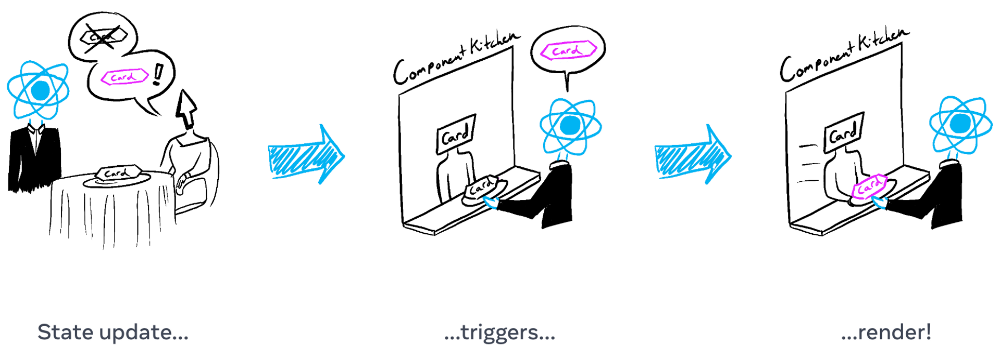
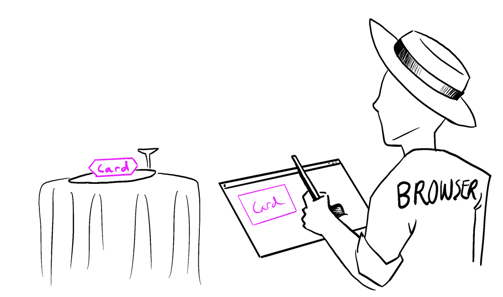

# 2-3. 렌더링하고 커밋하기

컴포넌트를 화면에 표시하기 이전에 React에서 렌더링을 해야 합니다. 해당 과정의 단계를 이해하면 코드가 어떻게 실행되는지 이해할 수 있고 리액트 렌더링 동작에 관해 설명하는데 도움이 됩니다.

> **학습 내용**
>
> - React에서 렌더링의 의미
> - React가 컴포넌트를 언제, 왜 렌더링 하는지
> - 화면에 컴포넌트를 표시하는 단계
> - 렌더링이 항상 DOM 업데이트를 하지 않는 이유

주방에서 요리사가 컴포넌트를 재료로 맛있는 요리를 한다고 상상해보세요. 이 시나리오에서 React는 고객들의 요청을 받고 주문을 가져오는 웨이터입니다. 이 과정에는 UI를 요청하고 제공하는 세 가지 단계가 있습니다.

1.  렌더링 **트리거** (손님의 주문을 주방으로 전달)
2.  컴포넌트 **렌더링** (주방에서 주문 받기)
3.  DOM에 **커밋** (테이블에 주문한 요리 내놓기)


## Step 1: 렌더링 트리거

컴포넌트 렌더링이 일어나는 데에는 두 가지 이유가 있습니다.

1.  컴포넌트의 **초기 렌더링인 경우**
2.  컴포넌트의 **state**(또는 상위 요소 중 하나)**가 업데이트된 경우**

### 초기 렌더

앱이 시작되면, 초기 렌더링을 트리거 해야합니다. 프레임워크와 샌드박스가 때때로 코드를 숨기지만, 대상 DOM 노드로 [createRoot](https://www.notion.so/79ff75b223b942e9b44659ae8451f8d0)를 호출한 다음 구성 요소로 `render` 메서드를 호출하면 됩니다.

```javascript
import Image from "./Image.js";
import { createRoot } from "react-dom/client";

const root = createRoot(document.getElementById("root"));
root.render(<Image />);
```

`root.render()` 호출을 주석 처리하고 컴포넌트가 사라지는 것을 확인하세요!

### state 업데이트시 리렌더링

컴포넌트가 처음 렌더링되면 [set함수](https://www.notion.so/35d982e6f31144afb9a6f60d9c419d6f)로 state를 업데이트하여 추가 렌더링을 트리거 시킬 수 있습니다. 컴포넌트의 state를 업데이트하면 자동으로 렌더링이 대기열에 추가됩니다. (이것은 식당에서 손님이 첫 주문 이후에 갈증이 나거나 배고파져서 차, 디저트 등을 추가로 주문하는 모습으로 상상해 볼 수 있습니다.)



## Step 2: React 컴포넌트 렌더링

렌더링을 트리거한 후 React는 컴포넌트를 호출하여 화면에 표시할 내용을 파악합니다. **"렌더링"은 React에서 컴포넌트를 호출하는 것입니다.**

- **초기 렌더링에서** React는 루트 컴포넌트를 호출합니다.
- **이후 렌더링에서** React는 state 업데이트가 일어나 렌더링을 트리거한 함수 컴포넌트를 호출합니다.

재귀적 단계: 업데이트된 컴포넌트가 다른 컴포넌트를 반환하면 React는 다음으로 _해당_ 컴포넌트를 렌더링하고 해당 컴포넌트도 컴포넌트를 반환하면 _반환된_ 컴포넌트를 다음에 렌더링하는 방식입니다. 중첩된 컴포넌트가 더 이상 없고 React가 화면에 표시되어야 하는 내용을 정확히 알 때까지 이 단계는 계속됩니다.

다음 예제에서 React는 `Gallery()`와 `Image()`를 여러 번 호출합니다

```javascript
export default function Gallery() {
  return (
    <section>
      <h1>Inspiring Sculptures</h1>
      <Image />
      <Image />
      <Image />
    </section>
  );
}

function Image() {
  return (
    
  );
}
```

**초기 렌더링 하는 동안** React는 `<section>`, `<h1>` 그리고 3개의 `` 태그에 대한 [DOM 노드를 생성](https://developer.mozilla.org/docs/Web/API/Document/createElement)합니다.

**리렌더링하는 동안** React는 이전 렌더링 이후 변경된 속성을 계산합니다. 다음 단계인 커밋 단계까지는 해당 정보로 아무런 작업도 수행하지 않습니다.

> **Pitfall**  
> 렌더링은 항상 [순수한 계산](https://www.notion.so/learn/keeping-components-pure)이어야 합니다:
>
> - **동일한 입력에는 동일한 출력을 해야합니다.** 동일한 입력이 주어지면 컴포넌트는 항상 동일한 JSX를 반환해야 합니다. (누군가 토마토 샐러드를 주문하면 그들은 양파가 있는 샐러드를 받으면 안 됩니다!)
> - **이전의 state를 변경해서는 안됩니다.** 렌더링 전에 존재했던 객체나 변수를 변경해서는 안 됩니다. (누군가의 주문이 다른 사람의 주문을 변경해서는 안 됩니다.)
>
> 그렇지 않으면 코드베이스가 복잡해짐에 따라 혼란스러운 버그와 예측할 수 없는 동작이 발생할 수 있습니다. "Strict Mode"에서 개발할 때 React는 각 컴포넌트의 함수를 두 번 호출하여 순수하지 않은 함수로 인한 실수를 표면화하는데 도움을 받을 수 있습니다.

**[DEEP DIVE] 성능 최적화**  
업데이트된 컴포넌트 내에 중첩된 모든 컴포넌트를 렌더링하는 기본 동작은 업데이트된 컴포넌트가 트리에서 매우 높은 곳에 있는 경우 성능 최적화되지 않습니다. 성능 문제가 발생하는 경우 [성능](https://www.notion.so/learn/performance) 섹션에 설명된 몇 가지 옵트인 방식으로 문제를 해결 할 수 있습니다. **성급하게 최적화하지 마세요!**

## Step 3: React가 DOM에 변경사항을 커밋

컴포넌트를 렌더링(호출)한 후 React는 DOM을 수정합니다.

- **초기 렌더링의 경우** React는 [appendChild()](https://developer.mozilla.org/docs/Web/API/Node/appendChild) DOM API를 사용하여 생성한 모든 DOM 노드를 화면에 표시합니다.
- **리렌더링의 경우** React는 필요한 최소한의 작업(렌더링하는 동안 계산된 것!)을 적용하여 DOM이 최신 렌더링 출력과 일치하도록 합니다.

**React는 렌더링 간에 차이가 있는 경우에만 DOM 노드를 변경합니다.** 예를 들어 매초 부모로부터 전달된 다른 props로 다시 렌더링하는 컴포넌트가 있습니다. `<input>`에 텍스트를 입력하여 `value`를 업데이트 하지만 컴포넌트가 리렌더링될 때 텍스트가 사라지지 않습니다.

```javascript
import { useState, useEffect } from "react";
import Clock from "./Clock.js";

function useTime() {
  const [time, setTime] = useState(() => new Date());
  useEffect(() => {
    const id = setInterval(() => {
      setTime(new Date());
    }, 1000);
    return () => clearInterval(id);
  }, []);
  return time;
}

function Clock({ time }) {
  return (
    <>
      <h1>{time}</h1>
      <input />
    </>
  );
}

export default function App() {
  const time = useTime();
  return <Clock time={time.toLocaleTimeString()} />;
}
```

마지막 단계에서 React가 `<h1>`의 내용만 새로운 `time`으로 업데이트하기 때문입니다. `<input>`이 JSX에서 이전과 같은 위치로 확인되므로 React는 `<input>` 또는 `value`를 건드리지 않습니다!

## 에필로그: 브라우저 페인트

렌더링이 완료되고 React가 DOM을 업데이트한 후 브라우저는 화면을 다시 그립니다. 이 단계를 "브라우저 렌더링"이라고 하지만 이 문서의 나머지 부분에서 혼동을 피하고자 "페인팅"이라고 부를 것입니다.



## Recap

> - React 앱의 모든 화면 업데이트는 세 단계로 이루어집니다.
>   1. 트리거
>   2. 렌더링
>   3. 커밋
> - Strict Mode를 사용하여 컴포넌트에서 실수를 찾을 수 있습니다.
> - 렌더링 결과가 이전과 같으면 React는 DOM을 건드리지 않습니다.
