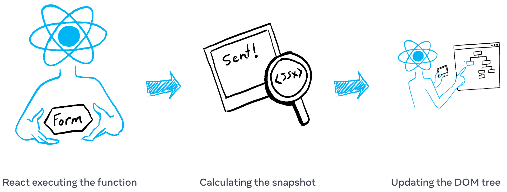
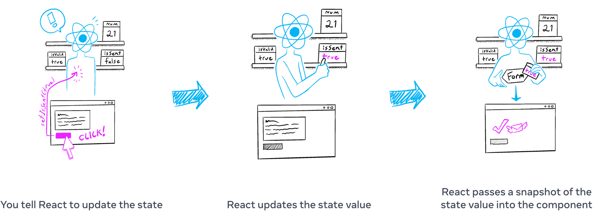

# 2-4. 스냅샷으로서의 state

state 변수는 읽고 쓸 수 있는 일반 JavaScript 변수처럼 보일 수 있습니다. 하지만 state는 스냅샷처럼 동작합니다. state 변수를 설정해도 이미 가지고 있는 state 변수는 변경되지 않고, 대신 재랜더링이 실행됩니다.

> 학습 내용
>
> - state 설정으로 리렌더링이 트리거되는 방식
> - state 업데이트 시기 및 방법
> - state를 설정한 직후에 state가 업데이트되지 않는 이유
> - 이벤트 핸들러가 state의 '스냅샷'에 액세스하는 방법

## state를 설정하면 렌더링이 실행됨

클릭과 같은 사용자 이벤트에 반응하여 사용자 인터페이스가 직접 변경된다고 생각할 수 있습니다. React에서는 이 멘탈 모델과는 조금 다르게 작동합니다. 이전 페이지에서 [state를 설정하면 React에 리렌더링을 요청](https://www.notion.so/ecf4950ea19d485bbd5df75040dc59d4)하는 것을 보았습니다. 즉, 인터페이스가 이벤트에 반응하려면 state를 업데이트해야 합니다.

이 예시에서는 "send"를 누르면 `setIsSent(true)`가 React에 UI를 다시 렌더링하도록 지시합니다:

```javascript
import { useState } from "react";

export default function Form() {
  const [isSent, setIsSent] = useState(false);
  const [message, setMessage] = useState("Hi!");
  if (isSent) {
    return <h1>Your message is on its way!</h1>;
  }
  return (
    <form
      onSubmit={(e) => {
        e.preventDefault();
        setIsSent(true);
        sendMessage(message);
      }}
    >
      <textarea
        placeholder="Message"
        value={message}
        onChange={(e) => setMessage(e.target.value)}
      />
      <button type="submit">Send</button>
    </form>
  );
}

function sendMessage(message) {
  // ...
}
```

**버튼을 클릭하면 다음과 같은 일이 발생합니다:**

1.  `onSubmit` 이벤트 핸들러가 실행됩니다.
2.  `setIsSent(true)`가 `isSent`를 `true`로 설정하고 새 렌더링을 큐에 대기시킵니다.
3.  React는 새로운 `isSent` 값에 따라 컴포넌트를 다시 렌더링합니다.

state와 렌더링의 관계를 자세히 살펴보겠습니다.

## 렌더링은 제 때 스냅샷을 찍음

"[렌더링](https://www.notion.so/ecf4950ea19d485bbd5df75040dc59d4)"이란 React가 컴포넌트, 즉 함수를 호출한다는 뜻입니다. 해당 함수에서 반환하는 JSX는 시간상 UI의 스냅샷과 같습니다. prop, 이벤트 핸들러, 로컬 변수는 모두 **렌더링 당시의 state를 사용해** 계산됩니다.

사진이나 동영상 프레임과 달리 반환하는 UI '스냅샷'은 대화형입니다. 여기에는 입력에 대한 응답으로 어떤 일이 일어날지 지정하는 이벤트 핸들러와 같은 로직이 포함됩니다. 그러면 React는 이 스냅샷과 일치하도록 화면을 업데이트하고 이벤트 핸들러를 연결합니다. 결과적으로 버튼을 누르면 JSX에서 클릭 핸들러가 트리거됩니다.

React가 컴포넌트를 다시 렌더링할 때:

1.  React가 함수를 다시 호출합니다.
2.  함수가 새로운 JSX 스냅샷을 반환합니다.
3.  그러면 React가 반환한 스냅샷과 일치하도록 화면을 업데이트합니다.



컴포넌트의 메모리로서 state는 함수가 반환된 후 사라지는 일반 변수와 다릅니다. state는 실제로 함수 외부에 마치 선반에 있는 것처럼 React 자체에 "존재"합니다. React가 컴포넌트를 호출하면 특정 렌더링에 대한 state의 스냅샷을 제공합니다. 컴포넌트는 **해당 렌더링의 state 값을 사용해** 계산된 새로운 props 세트와 이벤트 핸들러가 포함된 UI의 스냅샷을 JSX에 반환합니다!



> 1. 리액트에게 state를 업데이트 하도록 명령한다.
> 2. 리액트가 state값을 업데이트 한다.
> 3. 리액트가 state값의 스냅샷을 컴포넌트에 보낸다.

다음은 이것이 어떻게 작동하는지 보여주는 간단한 실험입니다. 이 예제에서는 '+3' 버튼을 클릭하면 `setNumber(number + 1)`를 세 번 호출하므로 카운터가 세 번 증가할 것으로 예상할 수 있습니다.

```javascript
import { useState } from "react";

export default function Counter() {
  const [number, setNumber] = useState(0);

  return (
    <>
      <h1>{number}</h1>
      <button
        onClick={() => {
          setNumber(number + 1);
          setNumber(number + 1);
          setNumber(number + 1);
        }}
      >
        +3
      </button>
    </>
  );
}
```

이 `number`는 클릭당 한 번만 증가한다는 점에 유의하세요!

**state를 설정하면 다음 렌더링에 대해서만 변경됩니다.** 첫 번째 렌더링에서 `number`는 `0`이었습니다. 따라서 해당 렌더링의 `onClick` 핸들러에서 `setNumber(number + 1)`가 호출된 후에도 `number`의 값은 여전히 `0`입니다:

```javascript
<button
  onClick={() => {
    setNumber(number + 1);
    setNumber(number + 1);
    setNumber(number + 1);
  }}
>
  +3
</button>
```

이 버튼의 클릭 핸들러가 React에게 지시하는 작업은 다음과 같습니다:

1.  `setNumber(number + 1)`: `number`는 `0`이므로 `setNumber(0 + 1)`입니다.
    - React는 다음 렌더링에서 `number`를 `1`로 변경할 준비를 합니다.
2.  `setNumber(number + 1)`: `number`는 `0`이므로 `setNumber(0 + 1)`입니다.
    - React는 다음 렌더링에서 `number`를 `1`로 변경할 준비를 합니다.
3.  `setNumber(number + 1)`: `number`는 `0`이므로 `setNumber(0 + 1)`입니다.
    - React는 다음 렌더링에서 `number`를 `1`로 변경할 준비를 합니다.

`setNumber(number + 1)`를 세 번 호출했지만, 이 렌더링에서 이벤트 핸들러의 `number`는 항상 `0`이므로 state를 `1`로 세 번 설정했습니다. 이것이 이벤트 핸들러가 완료된 후 React가 컴포넌트안의 `number` 를 `3`이 아닌 `1`로 다시 렌더링하는 이유입니다.

코드에서 state 변수를 해당 값으로 대입하여 이를 시각화할 수도 있습니다. 이 렌더링에서 `number` state 변수는 `0`이므로 이벤트 핸들러는 다음과 같습니다:

```javascript
<button
  onClick={() => {
    setNumber(0 + 1);
    setNumber(0 + 1);
    setNumber(0 + 1);
  }}
>
  +3
</button>
```

다음 렌더링에서는 `number`가 `1`이므로 렌더링의 클릭 핸들러는 다음과 같이 표시됩니다:

```javascript
<button
  onClick={() => {
    setNumber(1 + 1);
    setNumber(1 + 1);
    setNumber(1 + 1);
  }}
>
  +3
</button>
```

그렇기 때문에 버튼을 다시 클릭하면 카운터가 2로 설정되고, 다음 클릭 시에는 3으로 설정되는 방식입니다.

## 시간 경과에 따른 state

이 버튼을 클릭하면 어떤 알림이 표시되는지 맞춰보세요:

```javascript
import { useState } from "react";

export default function Counter() {
  const [number, setNumber] = useState(0);

  return (
    <>
      <h1>{number}</h1>
      <button
        onClick={() => {
          setNumber(number + 5);
          alert(number);
        }}
      >
        +5
      </button>
    </>
  );
}
```

이전부터 치환 방법을 사용하면 알림에 "0"이 표시된다는 것을 짐작할 수 있습니다:

```javascript
setNumber(0 + 5);
alert(0);
```

하지만 경고에 타이머를 설정하여 컴포넌트가 다시 렌더링된 후에만 발동하도록 하면 어떨까요? "0" 또는 "5"라고 표시될까요?

```javascript
import { useState } from "react";

export default function Counter() {
  const [number, setNumber] = useState(0);

  return (
    <>
      <h1>{number}</h1>
      <button
        onClick={() => {
          setNumber(number + 5);
          setTimeout(() => {
            alert(number);
          }, 3000);
        }}
      >
        +5
      </button>
    </>
  );
}
```

대체 방법을 사용하면 알림에 전달된 state의 '스냅샷'을 볼 수 있습니다.

```javascript
setNumber(0 + 5);
setTimeout(() => {
  alert(0);
}, 3000);
```

React에 저장된 state는 알림이 실행될 때 변경되었을 수 있지만, 사용자가 상호작용한 시점에 state 스냅샷을 사용하는 건 이미 예약되어 있던 것입니다!

**state 변수의 값은** 이벤트 핸들러의 코드가 비동기적이더라도 **렌더링 내에서 절대 변경되지 않습니다.** 해당 렌더링의 `onClick` 내에서, `setNumber(number + 5)`가 호출된 후에도 `number`의 값은 계속 `0`입니다. 이 값은 컴포넌트를 호출해 React가 UI의 “스냅샷을 찍을" 때 "고정"된 값입니다.

다음은 이벤트 핸들러가 타이밍 실수를 줄이는 방법을 보여주는 예입니다. 아래는 5초 지연된 메시지를 보내는 양식입니다. 이 시나리오를 상상해 보세요:

1.  "보내기" 버튼을 눌러 앨리스에게 "안녕하세요"를 보냅니다.
2.  5초 지연이 끝나기 전에 "받는 사람" 필드의 값을 "Bob"으로 변경합니다.

알림에 어떤 내용이 표시되기를 기대하나요? "앨리스에게 인사했습니다"라고 표시되나요? 아니면 "당신은 밥에게 인사했습니다"라고 표시될까요? 알고 있는 내용을 바탕으로 추측한 다음 시도해 보세요:

```javascript
import { useState } from "react";

export default function Form() {
  const [to, setTo] = useState("Alice");
  const [message, setMessage] = useState("Hello");

  function handleSubmit(e) {
    e.preventDefault();
    setTimeout(() => {
      alert(`You said ${message} to ${to}`);
    }, 5000);
  }

  return (
    <form onSubmit={handleSubmit}>
      <label>
        To:{" "}
        <select value={to} onChange={(e) => setTo(e.target.value)}>
          <option value="Alice">Alice</option>
          <option value="Bob">Bob</option>
        </select>
      </label>
      <textarea
        placeholder="Message"
        value={message}
        onChange={(e) => setMessage(e.target.value)}
      />
      <button type="submit">Send</button>
    </form>
  );
}
```

React는 하나의 렌더링 이벤트 핸들러 내에서 state 값을 "고정"으로 유지합니다. 코드가 실행되는 동안 state가 변경되었는지 걱정할 필요가 없습니다.

하지만 다시 렌더링하기 전에 최신 state를 읽고 싶다면 어떻게 해야 할까요? 다음 페이지에서 설명하는 [state 업데이터 함수](https://www.notion.so/bdd4397a90f34416b9bb8dbbb43d74ef)를 사용하면 됩니다!

## Recap

> - state를 설정하면 새 렌더링을 요청합니다.
> - React는 컴포넌트 외부에 마치 선반에 보관하듯 state를 저장합니다.
> - 'useState'를 호출하면 React는 해당 렌더링에 대한 state의 스냅샷을 제공합니다.
> - 변수와 이벤트 핸들러는 다시 렌더링해도 "살아남지" 않습니다. 모든 렌더링에는 자체 이벤트 핸들러가 있습니다.
> - 모든 렌더링(과 그 안에 있는 함수)은 항상 React가 *그 렌더링*에 제공한 state의 스냅샷을 "보게" 됩니다.
> - 렌더링된 JSX에 대해 생각하는 것처럼 이벤트 핸들러에서 state를 정신적으로 대체할 수 있습니다.
> - 과거에 생성된 이벤트 핸들러는 그것이 생성된 렌더링 시점의 state 값을 갖습니다.
