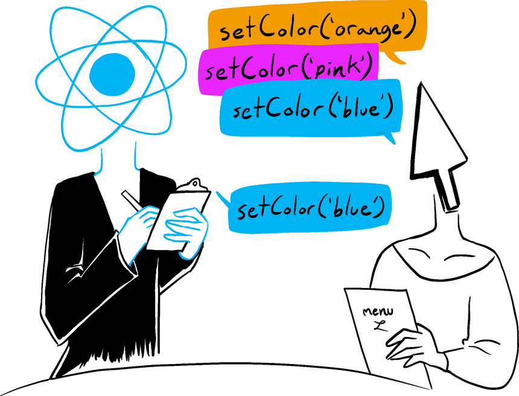

# 2-5. state 업데이트 큐

state 변수를 설정하면 다음 렌더링이 큐(대기열, queue)에 들어갑니다. 그러나 경우에 따라 다음 렌더링을 큐에 넣기 전에, 값에 대해 여러 작업을 수행하고 싶을 때도 있습니다. 이를 위해서는 React가 state 업데이트를 어떻게 배치하면 좋을지 이해하는 것이 도움이 됩니다.

> **학습 내용**
>
> - 일괄처리(배칭, batching)이란 무엇이며 React가 여러 state 업데이트를 처리하는 방법
> - 동일한 state 변수에서 여러 업데이트를 적용하는 방법

## state 업데이트 일괄처리

`setNumber(number + 1)` 를 세 번 호출하므로 “+3” 버튼을 클릭하면 세 번 증가할 것으로 예상할 수 있습니다:

```javascript
import { useState } from "react";

export default function Counter() {
  const [number, setNumber] = useState(0);

  return (
    <>
      <h1>{number}</h1>
      <button
        onClick={() => {
          setNumber(number + 1);
          setNumber(number + 1);
          setNumber(number + 1);
        }}
      >
        +3
      </button>
    </>
  );
}
```

그러나 이전 세션에서 기억할 수 있듯이, [각 렌더링의 state 값은 고정](https://www.notion.so/58da923a84be4ffc8055b113ee1819bc)되어 있으므로, 첫번째 렌더링의 이벤트 핸들러의 `number` 값은 `setNumber(1)`을 몇 번 호출하든 항상 `0`입니다.

```javascript
setNumber(0 + 1);
setNumber(0 + 1);
setNumber(0 + 1);
```

여기에는 논의 되어야 할 또 다른 요인이 있습니다. **React는 state 업데이트를 하기 전에 이벤트 핸들러의 모든 코드가 실행될 때까지 기다립니다.** 이 때문에 리렌더링은 모든 `setNumber()` 호출이 완료된 이후에만 일어납니다.

이는 음식점에서 주문을 받는 웨이터를 생각해 볼 수 있습니다. 웨이터는 첫번째 요리를 말하자마자 주방으로 달려가지 않습니다! 대신 주문이 끝날 때까지 기다렸다가 주문을 변경하고, 심지어 테이블에 있는 다른 사람의 주문도 받습니다.



이렇게 하면 너무 많은 리렌더링이 발생하지 않고도 여러 컴포넌트에서 나온 다수의 state 변수를 업데이트할 수 있습니다. 하지만 이는 이벤트 핸들러와 그 안에 있는 코드가 완료될 때까지 UI가 업데이트되지 않는다는 의미이기도 합니다. 일괄처리(배칭, batching)라고도 하는 이 동작은 React 앱을 훨씬 빠르게 실행할 수 있게 해줍니다. 또한 일부 변수만 업데이트된 "반쯤 완성된" 혼란스러운 렌더링을 처리하지 않아도 됩니다.

**React는 클릭과 같은 _여러_ 의도적인 이벤트에 대해 일괄 처리하지 않으며,** 각 클릭은 개별적으로 처리됩니다. React는 일반적으로 안전한 경우에만 일괄 처리를 수행하니 안심하세요. 예를 들어 첫 번째 버튼 클릭으로 양식이 비활성화되면 두 번째 클릭으로 양식이 다시 제출되지 않도록 보장합니다.

## 다음 렌더링 전에 동일한 state 변수를 여러 번 업데이트하기

흔한 사례는 아니지만, 다음 렌더링 전에 동일한 state 변수를 여러 번 업데이트 하고 싶다면 `setNumber(number + 1)` 와 같은 *다음 state 값*을 전달하는 대신, `setNumber(n => n + 1)` 와 같이 큐의 이전 state를 기반으로 다음 state를 계산하는 *함수*를 전달할 수 있습니다. 이는 단순히 state 값을 대체하는 것이 아니라 React에게 “state 값으로 무언가를 하라”고 지시하는 방법입니다.

```javascript
import { useState } from "react";

export default function Counter() {
  const [number, setNumber] = useState(0);

  return (
    <>
      <h1>{number}</h1>
      <button
        onClick={() => {
          setNumber((n) => n + 1);
          setNumber((n) => n + 1);
          setNumber((n) => n + 1);
        }}
      >
        +3
      </button>
    </>
  );
}
```

여기서 `n => n + 1` 는 **업데이터 함수(updater function)**라고 부릅니다. 이를 state 설정자 함수에 전달 할 때:

1.  React는 이벤트 핸들러의 다른 코드가 모두 실행된 후에 이 함수가 처리되도록 큐에 넣습니다.
2.  다음 렌더링 중에 React는 큐를 순회하여 최종 업데이트된 state를 제공합니다.

```javascript
setNumber((n) => n + 1);
setNumber((n) => n + 1);
setNumber((n) => n + 1);
```

React가 이벤트 핸들러를 수행하는 동안 여러 코드를 통해 작동하는 방식은 다음과 같습니다

1.  `setNumber(n => n + 1)`: `n => n + 1` 함수를 큐에 추가합니다.
2.  `setNumber(n => n + 1)`: `n => n + 1` 함수를 큐에 추가합니다.
3.  `setNumber(n => n + 1)`: `n => n + 1` 함수를 큐에 추가합니다.

다음 렌더링 중에 `useState` 를 호출하면 React는 큐를 순회합니다. 이전 `number` state는 `0`이었으므로 React는 이를 첫 번째 업데이터 함수에 `n` 인수로 전달합니다. 그런 다음 React는 이전 업데이터 함수의 반환값을 가져와서 다음 업데이터 함수에 `n` 으로 전달하는 식으로 반복합니다.

| queued update | n   | returns   |
| ------------- | --- | --------- |
| n => n + 1    | 0   | 0 + 1 = 1 |
| n => n + 1    | 1   | 1 + 1 = 2 |
| n => n + 1    | 2   | 2 + 1 = 3 |

React는 `3`을 최종 결과로 저장하고 `useState`에서 반환합니다.
이것이 위 예제 “+3”을 클릭하면 값이 3씩 올바르게 증가하는 이유입니다.

### state를 교체한 후 업데이트하면 어떻게 되나요?

이 이벤트 핸들러는 어떨까요? 다음 렌더링에서 `number`가 어떻게 될까요?

```javascript
import { useState } from "react";

export default function Counter() {
  const [number, setNumber] = useState(0);

  return (
    <>
      <h1>{number}</h1>
      <button
        onClick={() => {
          setNumber(number + 5);
          setNumber((n) => n + 1);
        }}
      >
        Increase the number
      </button>
    </>
  );
}
```

이 이벤트 핸들러가 React에게 지시하는 작업은 다음과 같습니다:

1.  `setNumber(number + 5)` : `number`는 `0`이므로 `setNumber(0 + 5)`입니다. React는 큐에 “*`5`*로 바꾸기”를 추가합니다.
2.  `setNumber(n => n + 1)` : `n => n + 1` 는 업데이터 함수입니다. React는 해당 함수를 큐에 추가합니다.

다음 렌더링 동안 React는 state 큐를 순회합니다:

| queued update    | n          | returns   |
| ---------------- | ---------- | --------- |
| “replace with 5” | 0 (unused) | 5         |
| n => n + 1       | 5          | 5 + 1 = 6 |

React는 `6`을 최종 결과로 저장하고 `useState`에서 반환합니다.

> 💡 `setState(x)`가 실제로는 `setState(n => x)` 처럼 동작되지만 `n`이 사용되지 않는다는 것을 눈치채셨을 것입니다!

### 업데이트 후 state를 바꾸면 어떻게 되나요?

한 가지 예를 더 들어보겠습니다. 다음 렌더링에서 `number`가 어떻게 될까요?

```javascript
import { useState } from "react";

export default function Counter() {
  const [number, setNumber] = useState(0);

  return (
    <>
      <h1>{number}</h1>
      <button
        onClick={() => {
          setNumber(number + 5);
          setNumber((n) => n + 1);
          setNumber(42);
        }}
      >
        Increase the number
      </button>
    </>
  );
}
```

이 이벤트 핸들러를 실행하는 동안 React가 이 코드를 통해 작동하는 방식은 다음과 같습니다:

1.  `setNumber(number + 5)`: `number` 는 `0` 이므로 `setNumber(0 + 5)`입니다. React는 *“`5`로 바꾸기”*를 큐에 추가합니다.
2.  `setNumber(n => n + 1)`: `n => n + 1` 는 업데이터 함수입니다. React는 *이 함수*를 큐에 추가합니다.
3.  `setNumber(42)`: React는 *“`42`로 바꾸기”*를 큐에 추가합니다.

다음 렌더링 동안, React는 state 큐를 순회합니다:

| queued update     | n          | returns   |
| ----------------- | ---------- | --------- |
| “replace with 5”  | 0 (unused) | 5         |
| n => n + 1        | 5          | 5 + 1 = 6 |
| “replace with 42” | 6 (unused) | 42        |

그런 다음 React는 `42`를 최종 결과로 저장하고 `useState`에서 반환합니다.

요약하자면, `setNumber` state 설정자 함수에 전달할 내용은 다음과 같이 생각할 수 있습니다:

- **업데이터 함수** (예: **`n => n + 1`**)가 큐에 추가됩니다.
- **다른 값** (예: 숫자 **`5`**)은 큐에 “`5`로 바꾸기”를 추가하며, 이미 큐에 대기중인 항목은 무시합니다.

이벤트 핸들러가 완료되면 React는 리렌더링을 실행합니다. 리렌더링하는 동안 React는 큐를 처리합니다. 업데이터 함수는 렌더링 중에 실행되므로, **업데이터 함수는** [순수](https://www.notion.so/5a9b60945b914de9aadc4e3c83211e01)**해야 하며 결과만 *반환*해야 합니다.** 업데이터 함수 내부에서 state를 변경하거나 다른 사이드 이팩트를 실행하려고 하지 마세요. Strict 모드에서 React는 각 업데이터 함수를 두 번 실행(두 번째 결과는 버림)하여 실수를 찾을 수 있도록 도와줍니다.

### 명명 규칙

업데이터 함수 인수의 이름은 해당 state 변수의 첫 글자로 지정하는 것이 일반적입니다:

```javascript
setEnabled((e) => !e);
setLastName((ln) => ln.reverse());
setFriendCount((fc) => fc * 2);
```

좀 더 자세한 코드를 선호하는 경우 `setEnabled(enabled => !enabled)`와 같이 전체 state 변수 이름을 반복하거나, `setEnabled(prevEnabled => !prevEnabled)`와 같은 접두사(prefix _“prev”_)를 사용하는 것이 일반적인 규칙입니다.

## Recap

- state를 설정하더라도 기존 렌더링의 변수는 변경되지 않으며, 대신 새로운 렌더링을 요청합니다.
- React는 이벤트 핸들러가 실행을 마친 후 state 업데이트를 처리합니다. 이를 일괄처리(배칭, batching)라고 합니다.
- 하나의 이벤트에서 일부 state를 여러 번 업데이트하려면 `setNumber(n => n + 1)` 업데이터 함수를 사용할 수 있습니다.
