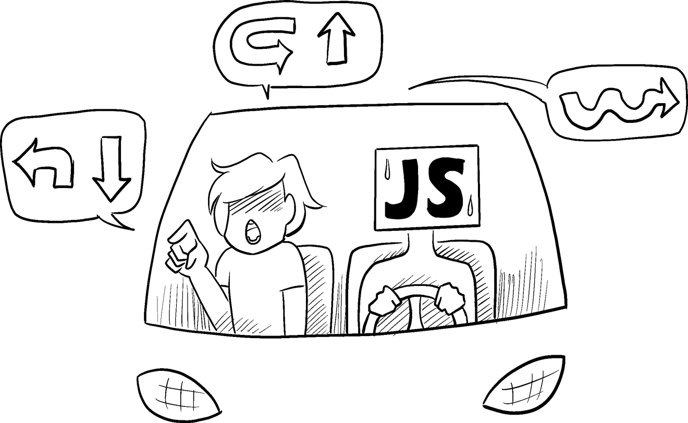
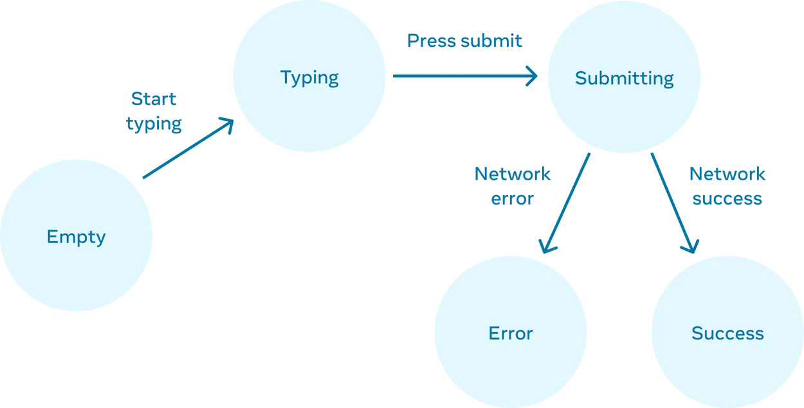

# 3-1. state로 입력에 반응하기

리액트는 선언적인 방식으로 UI를 조작합니다. 개별적인 UI를 직접 조작하는 것 대신에 컴포넌트 내부에 여러 state를 묘사하고 사용자의 입력에 따라 state를 변경합니다. 이는 디자이너가 UI를 바라보는 방식과 비슷합니다.

> **학습 내용**
>
> - 선언형 UI 프로그래밍과 명령형 UI 프로그래밍의 차이점
> - 컴포넌트가 있을 수 있는 다양한 시각적 state를 열거하는 방법
> - 코드에서 다른 시각적 state 간의 변경을 발동하는 방법

## 선언형 UI와 명령형 UI의 차이점

UI인터렉션을 디자인할 때 사용자의 행동에 따라 UI가 어떻게 *변하는지*에 대해서 생각해 보셨을 것입니다.
사용자가 답변을 제출할 수 있는 양식을 생각해 봅시다.

- 폼에 무언가를 입력하면 “Submit” 버튼이 **활성화될** 것입니다.
- “제출” 버튼을 누르면 폼과 버튼이 **비활성화**되고 스피너가 나타날 것입니다.
- 네트워크 요청이 성공한다면 form은 **숨겨질** 것이고 “Thank you”메세지가 **나타날** 것입니다.
- 네트워크 요청이 실패한다면 오류 메세지가 **보일** 것이고 form은 다시 **활성화** 될 것입니다.

**명령형 프로그래밍**에서 위의 내용은 인터랙션을 구현하는 방법에 직접적으로 해당합니다. 방금 일어난 일에 따라 UI를 조작하기 위한 정확한 지침을 작성해야합니다. 다른 방식으로 생각해봅시다: 자동차를 타고 가는 사람 옆에서 어디로 가야하는지 차례대로 알려주는 상상을 해봅시다.



운전자는 사용자가 어디로 가고 싶은지 모른 채 명령만 따를 뿐입니다. (지시를 잘못 내리면 엉뚱한 곳에 가게 됩니다!) 컴퓨터에게 스피너부터 버튼까지 각 요소에 “명령”을 내려 컴퓨터에 UI를 업데이트할 내용을 지시해야 하므로, 이를 *명령형*이라고 부릅니다.

다음 명령형 UI 프로그래밍 예시에서 form은 _React를 사용하지 않고_ 작성되었습니다. 대신 내장된 브라우저의 [DOM](https://developer.mozilla.org/en-US/docs/Web/API/Document_Object_Model)을 사용합니다:

```javascript
async function handleFormSubmit(e) {
  e.preventDefault();
  disable(textarea);
  disable(button);
  show(loadingMessage);
  hide(errorMessage);
  try {
    await submitForm(textarea.value);
    show(successMessage);
    hide(form);
  } catch (err) {
    show(errorMessage);
    errorMessage.textContent = err.message;
  } finally {
    hide(loadingMessage);
    enable(textarea);
    enable(button);
  }
}

function handleTextareaChange() {
  if (textarea.value.length === 0) {
    disable(button);
  } else {
    enable(button);
  }
}

function hide(el) {
  el.style.display = 'none';
}

function show(el) {
  el.style.display = '';
}

function enable(el) {
  el.disabled = false;
}

function disable(el) {
  el.disabled = true;
}

function submitForm(answer) {
  // Pretend it's hitting the network.
  return new Promise((resolve, reject) => {
    setTimeout(() => {
      if (answer.toLowerCase() == 'istanbul') {
        resolve();
      } else {
        reject(new Error('Good guess but a wrong answer. Try again!'));
      }
    }, 1500);
  });
}

let form = document.getElementById('form');
let textarea = document.getElementById('textarea');
let button = document.getElementById('button');
let loadingMessage = document.getElementById('loading');
let errorMessage = document.getElementById('error');
let successMessage = document.getElementById('success');
form.onsubmit = handleFormSubmit;
textarea.oninput = handleTextareaChange;
```

UI를 조작하는 것은 위와 같이 단순 고립된 예제에서는 충분히 잘 동작하지만, 더 복잡한 시스템에서는 관리하기가 기하급수적으로 어려워집니다. 다양한 form 양식으로 가득 찬 페이지를 업데이트 해야 한다고 생각해봅시다. 새로운 UI 요소나 새로운 인터랙션을 추가하려면 기존의 모든 코드를 주의 깊게 살펴 버그의 발생 여부(예를 들어 무언가를 표시하거나 숨기는 것을 잊는 등)를 확인해야 합니다.

React는 이런 문제를 해결하기 위해 만들어졌습니다.

React에서는 직접 UI를 조작하지 않습니다. 즉, 컴포넌트를 직접 활성화하거나 비활성화 하지도, 보여주거나 숨기지도 않습니다. 대신 표시할 내용을 선언하면 React가 UI를 업데이트할 방법을 알아냅니다. 택시를 타고 기사에게 정확히 어디서 꺾어야 할지를 알려주는 대신 어디로 가고 싶은지만 말한다고 생각해 보세요. 목적지까지 데려다주는 것은 택시기사의 몫이며, 기사는 여러분이 미처 생각하지 못한 지름길을 알고 있을 수도 있습니다!


## UI를 선언적인 방식으로 생각하기

위에서 form을 명령형으로 구현하는 방법을 살펴보았습니다. 아래에서는 React로 사고하는 방법을 더 잘 이해하기 위해 이 UI를 React로 다시 구현하는 과정을 살펴봅시다:

1.  컴포넌트의 다양한 시각적 상태를 **식별**합니다.
2.  상태 변화를 유발하는 요소를 **파악**합니다.
3.  `useState`를 사용하여 메모리의 상태를 **표현**합니다.
4.  비필수적인 state 변수를 **제거**합니다.
5.  이벤트 핸들러를 **연결**하여 state를 설정합니다.

### Step 1: 컴포넌트의 다양한 시각적 상태 식별하기

컴퓨터 과학에서 ["상태 머신"](https://en.wikipedia.org/wiki/Finite-state_machine)이란 여러가지 “상태”들 중 하나라는 말을 들어보셨을 것입니다. 디자이너와 함께 일한다면 다양한 “시각적인 상태”에 대한 목업을 보셨을 것입니다. React는 디자인과 컴퓨터 과학의 교차점에 서있기 때문에 이 두 아이디어 모두 영감의 원천이 됩니다.

먼저 사용자에게 표시될 수 있는 UI의 다양한 “상태”를 모두 시각화해야 합니다:

- **비어있음**: form의 “Submit”버튼은 비활성화되어 있습니다.
- **입력중**: form의 “Submit”버튼이 활성화되어 있습니다.
- **제출중**: form은 완전히 비활성화되어있고 Spinner가 표시됩니다.
- **성공시**: form 대신 “Thank you”메세지가 표시됩니다.
- **실패시**: ‘입력중’ 상태와 동일하지만 추가로 오류 메세지가 표시됩니다.

디자이너와 마찬가지로 로직을 추가하기 전에 다양한 상태에 대한 “목업”을 만들고 싶을 것입니다. 예를 들어 다음은 form의 시각적 부분만을 위한 목업입니다. 이 목업은 기본값이 `'empty'`인 `status`라는 prop으로 제어됩니다:

```javascript
export default function Form({ status = 'empty' }) {
  if (status === 'success') {
    return <h1>That's right!</h1>;
  }
  return (
    <>
      <h2>City quiz</h2>
      <p>
        In which city is there a billboard that turns air into drinkable water?
      </p>
      <form>
        <textarea />
        <br />
        <button>Submit</button>
      </form>
    </>
  );
}
```

prop의 이름은 원하는 것으로 정해도 되며, 중요하지 않습니다. `status = 'empty'`를 `status = 'success'` 로 편집하여 성공 메세지가 표시되는지 확인해 보세요. 목업을 사용하면 로직을 연결하기 전에 UI를 빠르게 반복해볼 수 있습니다. 다음은 동일한 컴포넌트의 좀 더 구체화된 프로토타입으로, 여전히 `status` prop에 의해 “제어”됩니다:

```javascript
export default function Form({
  // Try 'submitting', 'error', 'success':
  status = 'empty',
}) {
  if (status === 'success') {
    return <h1>That's right!</h1>;
  }
  return (
    <>
      <h2>City quiz</h2>
      <p>
        In which city is there a billboard that turns air into drinkable water?
      </p>
      <form>
        <textarea disabled={status === 'submitting'} />
        <br />
        <button disabled={status === 'empty' || status === 'submitting'}>
          Submit
        </button>
        {status === 'error' && (
          <p className='Error'>Good guess but a wrong answer. Try again!</p>
        )}
      </form>
    </>
  );
}
```

> [DEEP DIVE] 한 번에 여러 시각적 상태 표시하기  
> 컴포넌트에 시각적 상태가 많은 경우 한 페이지에 모두 표시하는 것이 편리할 수 있습니다:
>
> ```javascript
> import Form from './Form.js';
>
> let statuses = ['empty', 'typing', 'submitting', 'success', 'error'];
>
> export default function App() {
>   return (
>     <>
>       {statuses.map((status) => (
>         <section key={status}>
>           <h4>Form ({status}):</h4>
>           <Form status={status} />
>         </section>
>       ))}
>     </>
>   );
> }
> ```
>
> 이런 페이지를 보통 “living styleguide”또는 “storybook”이라 부릅니다.

### Step 2: 상태 변경을 유발하는 요인 파악하기

두 종류의 입력에 대한 응답으로 상태 변경을 유발할 수 있습니다:

- **사람의 입력** : 버튼 클릭, 필드 입력, 링크 이동 등
- **컴퓨터의 입력** : 네트워크에서 응답 도착, 시간 초과, 이미지 로딩 등

두 경우 모두 [state 변수](https://www.notion.so/2b87b53046e14485883b0bf8036311f6)를 설정해야 UI를 업데이트할 수 있습니다. 개발중인 form의 경우 몇 가지 다른 입력에 따라 state를 변경해야합니다:

- **text 입력을 변경**(사람)하면 text box가 비어있는지 여부에 따라 _비어있음_ state에서 입력중 state로, 또는 그 반대로 전환해야합니다.
- **제출 버튼을 클릭**(사람)하면 _제출중_ state로 전환해야합니다.
- 네트워크 응답 성공(컴퓨터)시 _성공_ state로 전환해야 합니다.
- 네트워크 요청 실패(컴퓨터)시 일치하는 오류 메세지와 함께 _오류_ state로 전환해야 합니다.

> **Note**  
> 사람의 입력에는 종종 [이벤트 핸들러](https://www.notion.so/47def8ff0c7849178c4be842d0d22d93)가 필요합니다!

이 흐름을 시각화하는 데 도움이 되도록 종이에 각 상태가 적힌 원을 그리고 각 상태 사이의 변경 사항을 화살표로 그려 보세요. 이 방식으로 흐름을 파악할 수 있을 뿐 아니라 구현하기 훨씬 전에 버그를 분류할 수 있습니다.



### Step 3: 메모리의 상태를 useState 로 표현하기

다음으로 메모리에서 컴포넌트의 시각적 상태를 [`useState`](https://www.notion.so/35d982e6f31144afb9a6f60d9c419d6f)로 표현해야합니다. 이 과정은 단순함이 핵심입니다. 각 상태 조각은 “움직이는 조각”이며, **가능한 적은 수의 “움직이는 조각”을 원합니다**. 복잡할수록 버그가 더 많이 발생합니다!

반드시 필요한 state부터 시작하세요. 예를 들어 입력에 대한 `answer`를 저장하고, 가장 마지막에 발생한 `error`(존재한다면)도 저장해야 합니다.

```javascript
const [answer, setAnswer] = useState('');
const [error, setError] = useState(null);
```

그런 다음 앞서 설명한 시각적 상태 중 어떤 상태를 표시할지를 나타내는 state 변수가 필요합니다. 일반적으로 메모리에서 이를 표현하는 방법은 여러가지가 있으므로 실험해봐야 합니다.

가장 좋은 방법을 즉시 생각하기 어렵다면 가능한 모든 시각적 상태를 _확실하게_ 다룰 수 있을 만큼 충분한 state를 추가하는 것부터 시작하세요.

```javascript
const [isEmpty, setIsEmpty] = useState(true);
const [isTyping, setIsTyping] = useState(false);
const [isSubmitting, setIsSubmitting] = useState(false);
const [isSuccess, setIsSuccess] = useState(false);
const [isError, setIsError] = useState(false);
```

처음 떠올린 생각이 최선이 아닐 수도 있지만 괜찮습니다. state를 리팩토링 하는 것도 과정의 일부이니까요!

### Step 4: 비필수적인 state 변수 제거하기

state 콘텐츠의 중복을 피해 필수적인 것만 추적하고 싶을 것입니다. state 구조를 리팩토링하는 데 약간의 시간을 투자하면 컴포넌트를 더 쉽게 이해하고, 중복을 줄이며, 의도하지 않은 경우를 피할 수 있습니다. 목표는 **state가 사용자에게 보여주기를 원하는 유효한 UI를 나타내지 않는 경우를 방지**하는 것입니다. (예를 들어 오류 메세지를 표시하면서 동시에 입력을 비활성화하면 사용자는 오류를 수정할 수 없게 됩니다!)

다음은 state 변수에 대해 물어볼 수 있는 몇가지 질문입니다:

- **state가 모순을 야기하나요?** 예를 들어 `isTyping` 과 `isSubmitting`은 동시에 `true`일 수 없습니다. 이러한 모순은 일반적으로 state가 충분히 제약되지 않았음을 의미합니다. 두 boolean의 조합은 네 가지가 가능하지만 유효한 state는 세 가지뿐입니다. “불가능한” state를 제거하려면 세 가지 값을 하나의 status로 결합하면 됩니다: `'typing'`, `'submitting'`, `'success'`.
- **다른 state변수에 이미 같은 정보가 있나요?** `isEmpty`와 `isTyping`은 동시에 `true`가 될 수 없습니다. 이를 각 state 변수로 분리하면 동기화되지 않아 버그가 발생할 위험이 있습니다. 다행히 `isEmpty`를 제거하고 대신 `answer.length === 0`으로 확인할 수 있습니다.
- **다른 state 변수를 뒤집으면 동일한 정보를 얻을 수 있나요?** `isError`는 `error !== null`을 대신 확인할 수 있기 때문에 필요하지 않습니다.

이렇게 정리하고 나면 3개(7개가 줄어든!)의 *필수 state 변수*만 남습니다:

```javascript
const [answer, setAnswer] = useState('');
const [error, setError] = useState(null);
const [status, setStatus] = useState('typing'); // 'typing', 'submitting', or 'success'
```

이들은 기능을 망가뜨리지 않고는 어느 하나도 제거할 수 없으므로 필수 요소임을 알 수 있습니다.

> [DEEP DIVE] reducer로 “불가능한” state 제거하기  
> 이 세 state 변수는 이 form의 상태를 충분히 잘 표현합니다. 그러나 여전히 완전히 설명되지 않는 중간 상태가 몇 가지 있습니다. 예를 들어 null이 아닌 `error`는 `status`가 `'success'`일 때는 의미가 없습니다. state를 조금 더 정확하게 모델링하려면 [reducer로 분리](https://www.notion.so/4140d35868f94530afe4cf3a2d3f37a4)하면 됩니다. reducer를 사용하면 여러 state 변수를 하나의 객체로 통합하고 관련된 모든 로직도 합칠 수 있습니다!

### Step 5: 이벤트 핸들러를 연결하여 state 설정하기

마지막으로 state 변수를 설정하는 이벤트 핸들러를 생성합니다. 아래는 모든 이벤트 핸들러가 연결된 최종 form입니다:

```javascript
import { useState } from 'react';

export default function Form() {
  const [answer, setAnswer] = useState('');
  const [error, setError] = useState(null);
  const [status, setStatus] = useState('typing');

  if (status === 'success') {
    return <h1>That's right!</h1>;
  }

  async function handleSubmit(e) {
    e.preventDefault();
    setStatus('submitting');
    try {
      await submitForm(answer);
      setStatus('success');
    } catch (err) {
      setStatus('typing');
      setError(err);
    }
  }

  function handleTextareaChange(e) {
    setAnswer(e.target.value);
  }

  return (
    <>
      <h2>City quiz</h2>
      <p>
        In which city is there a billboard that turns air into drinkable water?
      </p>
      <form onSubmit={handleSubmit}>
        <textarea
          value={answer}
          onChange={handleTextareaChange}
          disabled={status === 'submitting'}
        />
        <br />
        <button disabled={answer.length === 0 || status === 'submitting'}>
          Submit
        </button>
        {error !== null && <p className='Error'>{error.message}</p>}
      </form>
    </>
  );
}

function submitForm(answer) {
  // Pretend it's hitting the network.
  return new Promise((resolve, reject) => {
    setTimeout(() => {
      let shouldError = answer.toLowerCase() !== 'lima';
      if (shouldError) {
        reject(new Error('Good guess but a wrong answer. Try again!'));
      } else {
        resolve();
      }
    }, 1500);
  });
}
```

이 코드는 원래의 명령형 예제보다 길지만 훨씬 덜 취약합니다. 모든 상호작용을 state 변화로 표현하면 나중에 기존 상태를 깨지 않고도 새로운 시각적 상태를 도입할 수 있습니다. 또한 인터랙션 자체의 로직을 변경하지 않고도 각 state에 표시되어야 하는 항목을 변경할 수 있습니다.

## Recap

- 선언형 프로그래밍은 UI를 세밀하게 관리(명령형)하지 않고 각 시각적 상태에 대해 UI를 기술하는 것을 의미합니다.
- 컴포넌트를 개발할 때
  1. 모든 시각적 상태를 식별하세요.
  2. 사람 및 컴퓨터가 상태 변화를 유발하는 요인을 결정하세요.
  3. `useState`로 상태를 모델링하세요.
  4. 버그와 모순을 피하려면 비필수적인 state를 제거하세요.
  5. 이벤트 핸들러를 연결하여 state를 설정하세요
