# 3-4. state 보존 및 재설정

state는 컴포넌트 간에 격리됩니다. React는 UI 트리에서 어떤 컴포넌트가 어떤 state에 속하는지를 추적합니다. state를 언제 보존하고 언제 초기화할지를 제어할 수 있습니다.

> **학습 내용**
>
> - React가 컴포넌트 구조를 "보는" 방법
> - React가 state를 유지하거나 재설정하도록 선택할 때
> - React가 컴포넌트의 state를 재설정하도록 강제하는 방법
> - key와 type이 state 보존 여부에 영향을 미치는 방법

## UI 트리

브라우저는 UI를 모델링하기 위해 많은 트리 구조를 사용합니다. [DOM](https://developer.mozilla.org/ko/docs/Web/API/Document_Object_Model/Introduction)은 HTML 요소를 나타내고, [CSSOM](https://developer.mozilla.org/ko/docs/Web/API/CSS_Object_Model)은 CSS에 대해 동일한 역할을 합니다. 심지어 [접근성 트리](https://developer.mozilla.org/en-US/docs/Glossary/Accessibility_tree)도 있습니다!

React 또한 트리 구조를 사용하여 사용자가 만든 UI를 관리하고 모델링합니다. React는 JSX로부터 UI 트리를 만듭니다. 그런 다음 React DOM은 해당 UI 트리와 일치하도록 브라우저 DOM 엘리먼트를 업데이트합니다. (React Native는 이러한 트리를 모바일 플랫폼에 맞는 엘리먼트로 변환합니다.)

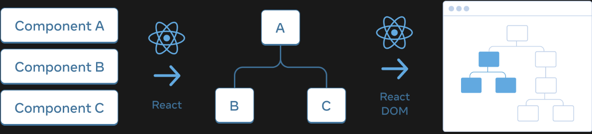

컴포넌트에서 React는 UI 트리를 생성하고, 이 트리는 React DOM이 DOM을 렌더링하는 데 사용됩니다.

## State는 트리의 한 위치에 묶입니다

컴포넌트에 state를 부여할 때, state가 컴포넌트 내부에 "존재"한다고 생각할 수 있습니다. 하지만 state는 실제로 React 내부에서 유지됩니다. React는 UI 트리에서 해당 컴포넌트가 어디에 위치하는지에 따라 보유하고 있는 각 state를 올바른 컴포넌트와 연결합니다.

여기에는 `<Counter />` JSX 태그가 하나만 있지만 두 개의 다른 위치에서 렌더링됩니다:

```javascript
import { useState } from 'react';

export default function App() {
  const counter = <Counter />;
  return (
    <div>
      {counter}
      {counter}
    </div>
  );
}

function Counter() {
  const [score, setScore] = useState(0);
  const [hover, setHover] = useState(false);

  let className = 'counter';
  if (hover) {
    className += ' hover';
  }

  return (
    <div
      className={className}
      onPointerEnter={() => setHover(true)}
      onPointerLeave={() => setHover(false)}
    >
      <h1>{score}</h1>
      <button onClick={() => setScore(score + 1)}>Add one</button>
    </div>
  );
}
```

트리로 표시되는 모습은 다음과 같습니다:

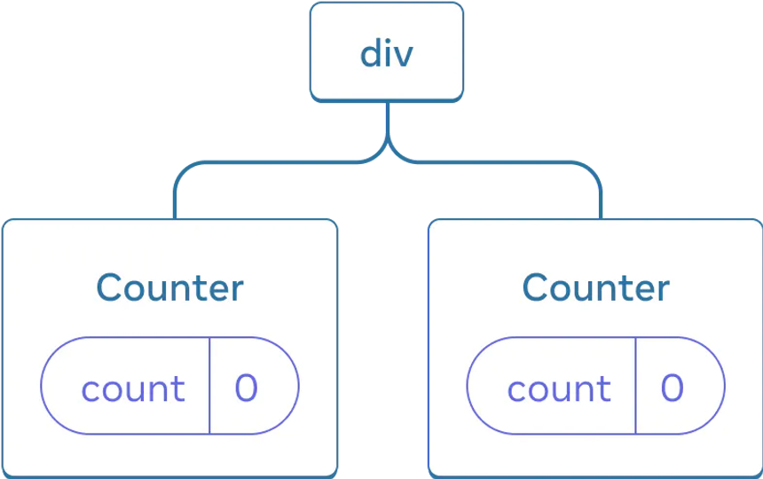

**이 카운터는 각 트리에서 고유한 위치에 렌더링되기 때문에 두 개의 개별 카운터입니다.** 일반적으로 React를 사용하기 위해 이러한 위치에 대해 생각할 필요는 없지만, 작동 방식을 이해하는 것이 유용할 수 있습니다.

React에서 화면의 각 컴포넌트는 완전히 분리된 상태를 갖습니다. 예를 들어 두 개의 `Counter` 컴포넌트를 나란히 렌더링하면 각각 독립적인 `score` 및 `hover` 상태를 갖게 됩니다.

두 counter를 모두 클릭해 보면 서로 영향을 미치지 않는 것을 확인할 수 있습니다:

```javascript
import { useState } from 'react';

export default function App() {
  return (
    <div>
      <Counter />
      <Counter />
    </div>
  );
}

function Counter() {
  const [score, setScore] = useState(0);
  const [hover, setHover] = useState(false);

  let className = 'counter';
  if (hover) {
    className += ' hover';
  }

  return (
    <div
      className={className}
      onPointerEnter={() => setHover(true)}
      onPointerLeave={() => setHover(false)}
    >
      <h1>{score}</h1>
      <button onClick={() => setScore(score + 1)}>Add one</button>
    </div>
  );
}
```

보시다시피 counter 하나가 업데이트되면 해당 컴포넌트에 대한 상태만 업데이트됩니다:

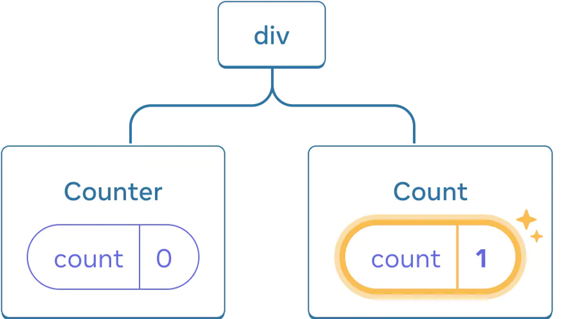

React는 같은 컴포넌트를 같은 위치에 렌더링하는 한 그 state를 유지합니다. 이를 확인하려면 두 카운터를 모두 증가시킨 다음 "두 번째 counter 렌더링" 체크박스를 선택 해제하여 두 번째 컴포넌트를 제거한 다음 다시 선택하여 다시 추가합니다:

```javascript
import { useState } from 'react';

export default function App() {
  const [showB, setShowB] = useState(true);
  return (
    <div>
      <Counter />
      {showB && <Counter />}
      <label>
        <input
          type='checkbox'
          checked={showB}
          onChange={(e) => {
            setShowB(e.target.checked);
          }}
        />
        Render the second counter
      </label>
    </div>
  );
}

function Counter() {
  const [score, setScore] = useState(0);
  const [hover, setHover] = useState(false);

  let className = 'counter';
  if (hover) {
    className += ' hover';
  }

  return (
    <div
      className={className}
      onPointerEnter={() => setHover(true)}
      onPointerLeave={() => setHover(false)}
    >
      <h1>{score}</h1>
      <button onClick={() => setScore(score + 1)}>Add one</button>
    </div>
  );
}
```

두 번째 counter 렌더링을 중지하는 순간 state가 완전히 사라지는 것을 주목하세요. React가 컴포넌트를 제거하면 그 state가 사라지기 때문입니다.

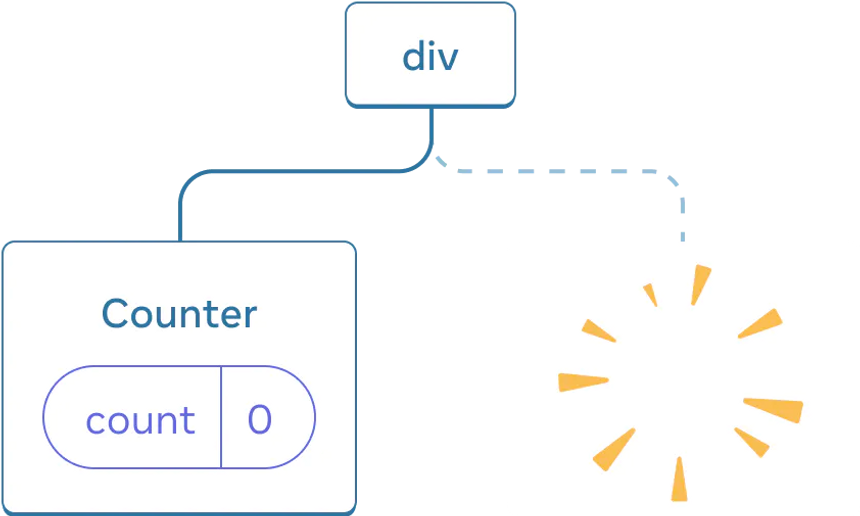

"두 번째 counter 렌더링"을 선택하면 두 번째 `Counter`와 그 state가 처음부터 초기화되고(`score = 0`) DOM에 추가됩니다.

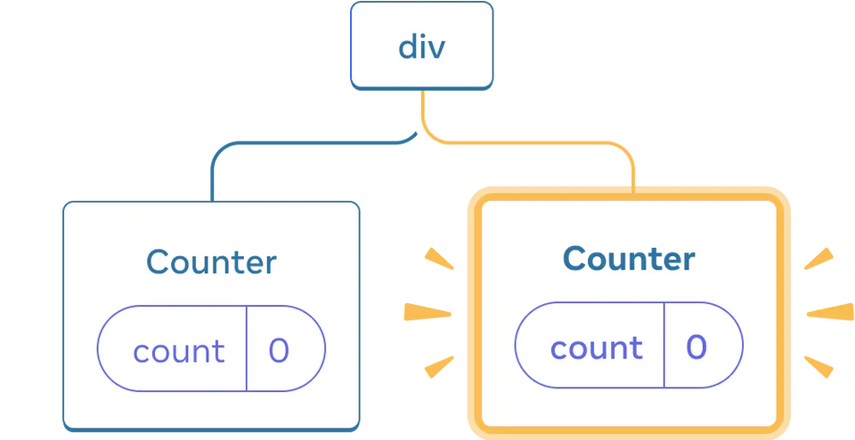

React는 컴포넌트가 UI 트리의 해당 위치에서 렌더링되는 동안 컴포넌트의 state를 유지합니다. 컴포넌트가 제거되거나 같은 위치에 다른 컴포넌트가 렌더링되면 React는 해당 컴포넌트의 state를 삭제합니다.

## 동일한 위치의 동일한 컴포넌트는 state를 유지합니다.

이 예제에는 두 개의 서로 다른 `<Counter />` 태그가 있습니다:

```javascript
import { useState } from 'react';

export default function App() {
  const [isFancy, setIsFancy] = useState(false);
  return (
    <div>
      {isFancy ? <Counter isFancy={true} /> : <Counter isFancy={false} />}
      <label>
        <input
          type='checkbox'
          checked={isFancy}
          onChange={(e) => {
            setIsFancy(e.target.checked);
          }}
        />
        Use fancy styling
      </label>
    </div>
  );
}

function Counter({ isFancy }) {
  const [score, setScore] = useState(0);
  const [hover, setHover] = useState(false);

  let className = 'counter';
  if (hover) {
    className += ' hover';
  }
  if (isFancy) {
    className += ' fancy';
  }

  return (
    <div
      className={className}
      onPointerEnter={() => setHover(true)}
      onPointerLeave={() => setHover(false)}
    >
      <h1>{score}</h1>
      <button onClick={() => setScore(score + 1)}>Add one</button>
    </div>
  );
}
```

체크박스를 선택하거나 선택 취소해도 카운터 state는 재설정되지 않습니다. `isFancy`가 `true`이든 `false`이든, 루트 `App` 컴포넌트에서 반환된 `div`의 첫 번째 자식에는 항상 `<Counter />`가 있습니다:

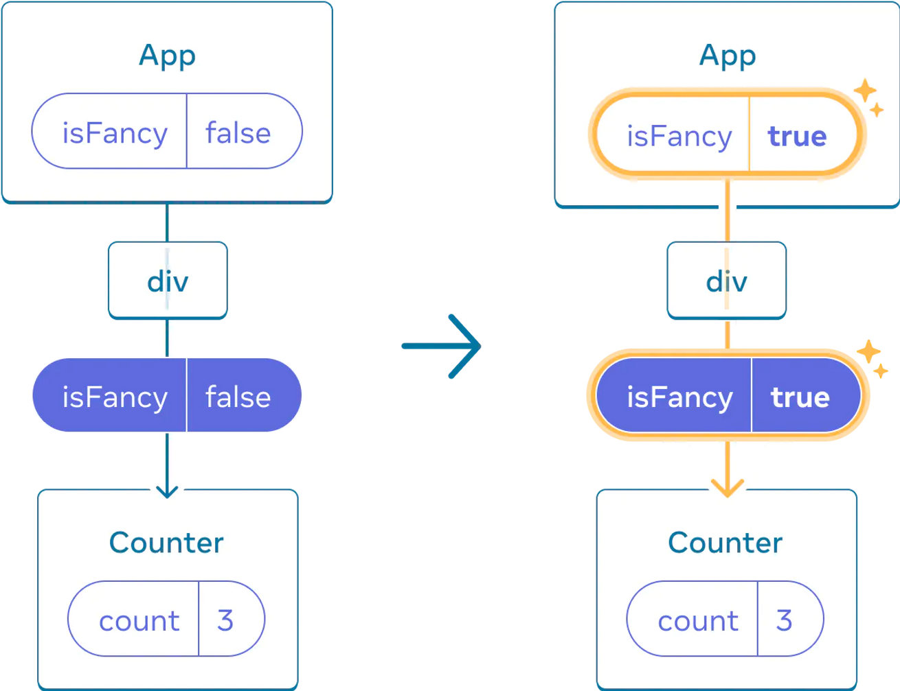

`Counter`는 동일한 위치에 유지되므로 `App` state를 업데이트해도 `Counter`는 재설정되지 않습니다.

같은 위치에 있는 같은 컴포넌트이므로 React의 관점에서 보면 같은 카운터입니다.

> **Pitfall**  
> **React에서 중요한 것은 JSX 마크업이 아니라 UI 트리에서의 위치라는 것을 기억하세요!** 이 컴포넌트에는 `if` 내부와 외부에 서로 다른 `<Counter />` JSX 태그가 있는 두 개의 `return`절이 있습니다:
>
> ```javascript
> import { useState } from 'react';
>
> export default function App() {
>   const [isFancy, setIsFancy] = useState(false);
>   if (isFancy) {
>     return (
>       <div>
>         <Counter isFancy={true} />
>         <label>
>           <input
>             type='checkbox'
>             checked={isFancy}
>             onChange={(e) => {
>               setIsFancy(e.target.checked);
>             }}
>           />
>           Use fancy styling
>         </label>
>       </div>
>     );
>   }
>   return (
>     <div>
>       <Counter isFancy={false} />
>       <label>
>         <input
>           type='checkbox'
>           checked={isFancy}
>           onChange={(e) => {
>             setIsFancy(e.target.checked);
>           }}
>         />
>         Use fancy styling
>       </label>
>     </div>
>   );
> }
>
> function Counter({ isFancy }) {
>   const [score, setScore] = useState(0);
>   const [hover, setHover] = useState(false);
>
>   let className = 'counter';
>   if (hover) {
>     className += ' hover';
>   }
>   if (isFancy) {
>     className += ' fancy';
>   }
>
>   return (
>     <div
>       className={className}
>       onPointerEnter={() => setHover(true)}
>       onPointerLeave={() => setHover(false)}
>     >
>       <h1>{score}</h1>
>       <button onClick={() => setScore(score + 1)}>Add one</button>
>     </div>
>   );
> }
> ```
>
> checkbox를 선택하면 state가 재설정될 것으로 예상할 수 있지만 그렇지 않습니다! 이 **두 `<Counter />` 태그가 모두 같은 위치에 렌더링되기 때문입니다.** React는 함수에서 조건을 어디에 배치했는지 알지 못합니다. 단지 여러분이 반환하는 트리만 볼 수 있을 뿐입니다. 두 경우 모두 `App` 컴포넌트는 `<Counter />`를 첫 번째 자식으로 가진 `<div>`를 반환합니다. 이것이 React가 이들을 동일한 `<Counter />`로 간주하는 이유입니다.  
> 루트의 첫 번째 자식의 첫 번째 자식이라는 동일한 "주소"를 가진 것으로 생각할 수 있습니다. 이것이 로직을 어떻게 구성하든 상관없이 이전 렌더링과 다음 렌더링 사이에서 React가 이들을 일치시키는 방식입니다.

## 동일한 위치의 다른 컴포넌트는 state를 초기화합니다.

이 예제에서 확인란을 선택하면 `<Counter/>`가 `<p>`로 바뀝니다:

```javascript
import { useState } from 'react';

export default function App() {
  const [isPaused, setIsPaused] = useState(false);
  return (
    <div>
      {isPaused ? <p>See you later!</p> : <Counter />}
      <label>
        <input
          type='checkbox'
          checked={isPaused}
          onChange={(e) => {
            setIsPaused(e.target.checked);
          }}
        />
        Take a break
      </label>
    </div>
  );
}

function Counter() {
  const [score, setScore] = useState(0);
  const [hover, setHover] = useState(false);

  let className = 'counter';
  if (hover) {
    className += ' hover';
  }

  return (
    <div
      className={className}
      onPointerEnter={() => setHover(true)}
      onPointerLeave={() => setHover(false)}
    >
      <h1>{score}</h1>
      <button onClick={() => setScore(score + 1)}>Add one</button>
    </div>
  );
}
```

여기서는 같은 위치에서 서로 다른 컴포넌트 유형 사이를 전환합니다. 처음에 `<div>`의 첫 번째 자식에는 `Counter`가 있었습니다. 하지만 `p`를 넣었을 때 React는 UI 트리에서 `Counter`를 제거하고 그 상태를 소멸시켰습니다.

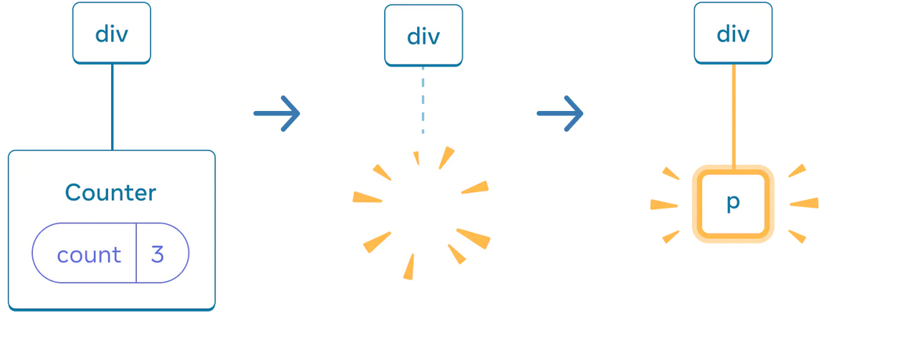

`Counter`가 `p`로 변경되면 `Counter`가 삭제되고 `p`가 추가됩니다.

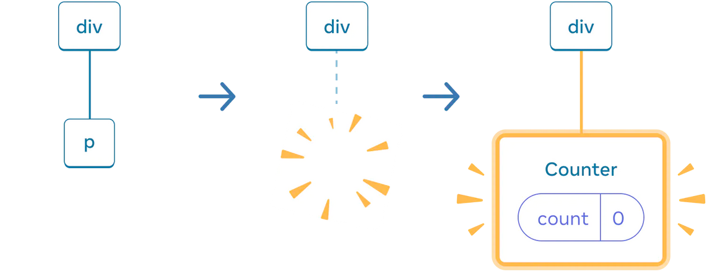

다시 전환하면 `p`가 삭제되고 `Counter`가 추가됩니다.

또한 같은 위치에 다른 컴포넌트를 렌더링하면 전체 하위 트리의 state가 재설정됩니다. 어떻게 작동하는지 확인하려면 카운터를 증가시킨 다음 확인란을 선택합니다:

```javascript
import { useState } from 'react';

export default function App() {
  const [isFancy, setIsFancy] = useState(false);
  return (
    <div>
      {isFancy ? (
        <div>
          <Counter isFancy={true} />
        </div>
      ) : (
        <section>
          <Counter isFancy={false} />
        </section>
      )}
      <label>
        <input
          type='checkbox'
          checked={isFancy}
          onChange={(e) => {
            setIsFancy(e.target.checked);
          }}
        />
        Use fancy styling
      </label>
    </div>
  );
}

function Counter({ isFancy }) {
  const [score, setScore] = useState(0);
  const [hover, setHover] = useState(false);

  let className = 'counter';
  if (hover) {
    className += ' hover';
  }
  if (isFancy) {
    className += ' fancy';
  }

  return (
    <div
      className={className}
      onPointerEnter={() => setHover(true)}
      onPointerLeave={() => setHover(false)}
    >
      <h1>{score}</h1>
      <button onClick={() => setScore(score + 1)}>Add one</button>
    </div>
  );
}
```

확인란을 클릭하면 counter state가 재설정됩니다. `Counter`를 렌더링하더라도 `div`의 첫 번째 자식은 `div`에서 `section`으로 변경됩니다. 자식 `div`가 DOM에서 제거되면 그 아래의 전체 트리(카운터 및 해당 상태 포함)도 함께 제거됩니다.

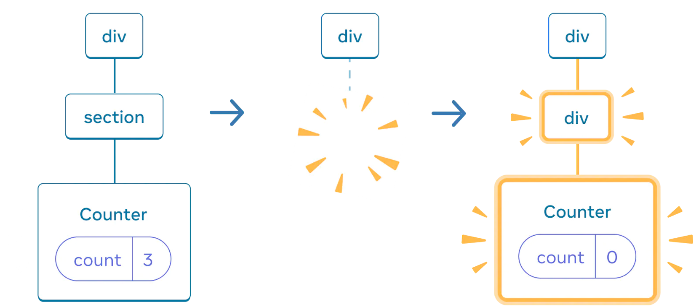

`section`이 `div`로 변경되면 `section`이 삭제되고 새 `div`가 추가됩니다.

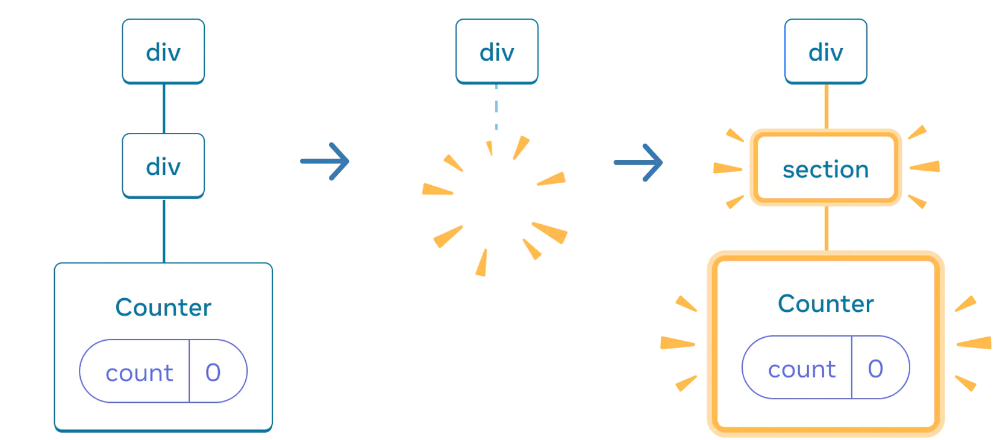

다시 전환하면 `div`가 삭제되고 새 `section`이 추가됩니다.

경험칙상, **리렌더링 사이에 state를 유지하려면 트리의 구조가 "일치"해야 합니다.** 구조가 다르면 React는 트리에서 컴포넌트를 제거할 때 state를 파괴하기 때문입니다.

> **Pitfall**  
> 그렇기 때문에 컴포넌트 함수 정의를 중첩해서는 안 됩니다.  
> 여기서는 `MyTextField` 컴포넌트 함수가 `MyComponent` 안에 정의되어 있습니다:
>
> ```javascript
> import { useState } from 'react';
>
> export default function MyComponent() {
>   const [counter, setCounter] = useState(0);
>
>   function MyTextField() {
>     const [text, setText] = useState('');
>     return <input value={text} onChange={(e) => setText(e.target.value)} />;
>   }
>
>   return (
>     <>
>       <MyTextField />
>       <button
>         onClick={() => {
>           setCounter(counter + 1);
>         }}
>       >
>         Clicked {counter} times
>       </button>
>     </>
>   );
> }
> ```
>
> 버튼을 클릭할 때마다 입력 state가 사라집니다! 이는 `MyComponent`를 렌더링할 때마다 다른 `MyTextField` 함수가 생성되기 때문입니다. 같은 위치에 다른 컴포넌트를 렌더링하기 때문에 React는 아래의 모든 state를 초기화합니다. 이로 인해 버그와 성능 문제가 발생합니다. 이 **문제를 방지하려면 항상 컴포넌트 함수를 최상위 수준에서 선언하고 정의를 중첩하지 마세요.**

## 동일한 위치에서 state 재설정하기

기본적으로 React는 컴포넌트가 같은 위치에 있는 동안 컴포넌트의 state를 보존합니다. 일반적으로 이것은 사용자가 원하는 것이므로 기본 동작으로 적합합니다. 하지만 때로는 컴포넌트의 state를 리셋하고 싶을 때가 있습니다. 두 명의 플레이어가 각 턴 동안 점수를 추적할 수 있는 이 앱을 예로 들어보겠습니다:

```javascript
import { useState } from 'react';

export default function Scoreboard() {
  const [isPlayerA, setIsPlayerA] = useState(true);
  return (
    <div>
      {isPlayerA ? <Counter person='Taylor' /> : <Counter person='Sarah' />}
      <button
        onClick={() => {
          setIsPlayerA(!isPlayerA);
        }}
      >
        Next player!
      </button>
    </div>
  );
}

function Counter({ person }) {
  const [score, setScore] = useState(0);
  const [hover, setHover] = useState(false);

  let className = 'counter';
  if (hover) {
    className += ' hover';
  }

  return (
    <div
      className={className}
      onPointerEnter={() => setHover(true)}
      onPointerLeave={() => setHover(false)}
    >
      <h1>
        {person}'s score: {score}
      </h1>
      <button onClick={() => setScore(score + 1)}>Add one</button>
    </div>
  );
}
```

현재 플레이어를 변경하면 점수가 보존됩니다. 두 `Counter`는 같은 위치에 표시되므로 React는 `person` prop이 변경된 동일한 `Counter`로 간주합니다.

하지만 개념적으로 이 앱에서는 두 개의 별도 카운터가 있어야 합니다. UI에서 같은 위치에 표시될 수도 있지만 하나는 Taylor의 카운터이고 다른 하나는 Sarah의 카운터입니다.

전환할 때 상태를 재설정하는 방법에는 두 가지가 있습니다:

1.  컴포넌트를 다른 위치에 렌더링하기
2.  각 컴포넌트에 키로 명시적인 아이덴티티를 부여합니다.

### Option 1: 컴포넌트를 다른 위치에 렌더링하기

이 두 `Counter`를 독립적으로 만들려면 두 개의 다른 위치에 렌더링하면 됩니다:

```javascript
import { useState } from 'react';

export default function Scoreboard() {
  const [isPlayerA, setIsPlayerA] = useState(true);
  return (
    <div>
      {isPlayerA && <Counter person='Taylor' />}
      {!isPlayerA && <Counter person='Sarah' />}
      <button
        onClick={() => {
          setIsPlayerA(!isPlayerA);
        }}
      >
        Next player!
      </button>
    </div>
  );
}

function Counter({ person }) {
  const [score, setScore] = useState(0);
  const [hover, setHover] = useState(false);

  let className = 'counter';
  if (hover) {
    className += ' hover';
  }

  return (
    <div
      className={className}
      onPointerEnter={() => setHover(true)}
      onPointerLeave={() => setHover(false)}
    >
      <h1>
        {person}'s score: {score}
      </h1>
      <button onClick={() => setScore(score + 1)}>Add one</button>
    </div>
  );
}
```

- 처음에는 `isPlayerA`가 `true`입니다. 따라서 첫 번째 위치에는 `Counter` 상태가 포함되고 두 번째 위치는 비어 있습니다.
- "Next player" 버튼을 클릭하면 첫 번째 위치는 지워지지만 두 번째 위치에는 이제 `Counter`가 포함됩니다.

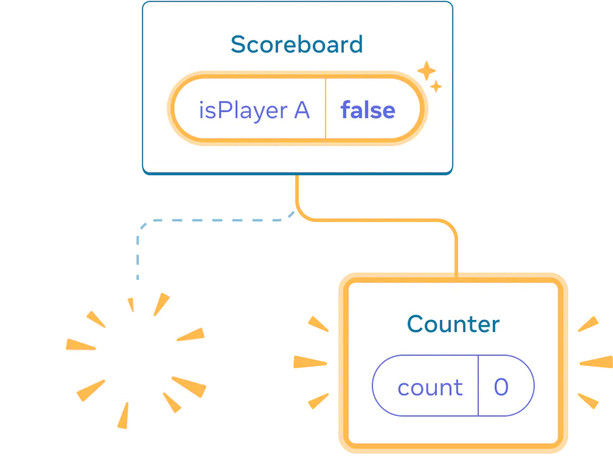

각 `Counter`의 state는 DOM에서 제거될 때마다 소멸됩니다. 그렇기 때문에 버튼을 클릭할 때마다 초기화됩니다.

이 솔루션은 같은 위치에 몇 개의 독립적인 컴포넌트만 렌더링할 때 편리합니다. 이 예시에서는 두 개만 있으므로 JSX에서 두 컴포넌트를 별도로 렌더링하는 것이 번거롭지 않습니다.

### Option 2: key로 state 재설정하기

컴포넌트의 state를 재설정하는 더 일반적인 방법도 있습니다.

[목록을 렌더링](https://www.notion.so/25246ef00d14407fb113ea66961946b3)할 때 `key`를 본 적이 있을 것입니다. key는 목록에만 사용되는 것이 아닙니다! key를 사용해 React가 모든 컴포넌트를 구분하도록 할 수 있습니다. 기본적으로 React는 부모 내의 순서("첫 번째 counter", "두 번째 counter")를 사용해 컴포넌트를 구분합니다. 하지만 key를 사용하면 이것이 첫 번째 counter나 두 번째 counter가 아니라 특정 counter(예: Taylor의 counter)임을 React에 알릴 수 있습니다. 이렇게 하면 React는 테일러의 counter가 트리에 어디에 나타나든 알 수 있습니다!

다음 예제에서는 두 `<Counter />`가 JSX에서 같은 위치에 표시되지만 state를 공유하지 않습니다:

```javascript
import { useState } from 'react';

export default function Scoreboard() {
  const [isPlayerA, setIsPlayerA] = useState(true);
  return (
    <div>
      {isPlayerA ? (
        <Counter key='Taylor' person='Taylor' />
      ) : (
        <Counter key='Sarah' person='Sarah' />
      )}
      <button
        onClick={() => {
          setIsPlayerA(!isPlayerA);
        }}
      >
        Next player!
      </button>
    </div>
  );
}

function Counter({ person }) {
  const [score, setScore] = useState(0);
  const [hover, setHover] = useState(false);

  let className = 'counter';
  if (hover) {
    className += ' hover';
  }

  return (
    <div
      className={className}
      onPointerEnter={() => setHover(true)}
      onPointerLeave={() => setHover(false)}
    >
      <h1>
        {person}'s score: {score}
      </h1>
      <button onClick={() => setScore(score + 1)}>Add one</button>
    </div>
  );
}
```

테일러와 사라 사이를 전환해도 state가 유지되지 않습니다. **서로 다른 `key`를 부여했기 때문입니다:**

```javascript
{
  isPlayerA ? (
    <Counter key='Taylor' person='Taylor' />
  ) : (
    <Counter key='Sarah' person='Sarah' />
  );
}
```

`key`를 지정하면 React가 부모 내 순서가 아닌 `key` 자체를 위치의 일부로 사용하도록 지시합니다. 그렇기 때문에 JSX에서 같은 위치에 렌더링하더라도 React의 관점에서 보면 두 카운터는 서로 다른 카운터입니다. 결과적으로 state를 공유하지 않습니다. 카운터가 화면에 나타날 때마다 그 상태가 생성됩니다. 카운터가 제거될 때마다 그 state는 소멸됩니다. 두 카운터 사이를 토글하면 state가 계속 초기화됩니다.

> **Note**  
> 키는 전역으로 고유하지는 않다는 점을 기억하세요. 키는 부모 내에서의 위치만 지정합니다.

### 키로 form 재설정하기

키로 state를 재설정하는 것은 form을 다룰 때 특히 유용합니다

이 채팅 앱에서 `<Chat>` 컴포넌트는 텍스트 입력 상태를 포함합니다:

```javascript
import { useState } from 'react';
import Chat from './Chat.js';
import ContactList from './ContactList.js';

export default function Messenger() {
  const [to, setTo] = useState(contacts[0]);
  return (
    <div>
      <ContactList
        contacts={contacts}
        selectedContact={to}
        onSelect={(contact) => setTo(contact)}
      />
      <Chat contact={to} />
    </div>
  );
}

const contacts = [
  { id: 0, name: 'Taylor', email: 'taylor@mail.com' },
  { id: 1, name: 'Alice', email: 'alice@mail.com' },
  { id: 2, name: 'Bob', email: 'bob@mail.com' },
];
```

```javascript
export default function ContactList({ selectedContact, contacts, onSelect }) {
  return (
    <section className='contact-list'>
      <ul>
        {contacts.map((contact) => (
          <li key={contact.id}>
            <button
              onClick={() => {
                onSelect(contact);
              }}
            >
              {contact.name}
            </button>
          </li>
        ))}
      </ul>
    </section>
  );
}
```

```javascript
import { useState } from 'react';

export default function Chat({ contact }) {
  const [text, setText] = useState('');
  return (
    <section className='chat'>
      <textarea
        value={text}
        placeholder={'Chat to ' + contact.name}
        onChange={(e) => setText(e.target.value)}
      />
      <br />
      <button>Send to {contact.email}</button>
    </section>
  );
}
```

입력란에 무언가를 입력한 다음 "앨리스" 또는 "밥"을 눌러 다른 수신자를 선택하세요. `<Chat>`이 트리의 동일한 위치에 렌더링되므로 입력 state가 유지되는 것을 알 수 있습니다.

**많은 앱에서 이러한 동작이 바람직할 수 있지만, 채팅 앱에서는 그렇지 않습니다!** 사용자가 실수로 클릭해서 이미 입력한 메시지를 엉뚱한 사람에게 보내는 것을 원치 않을 것입니다. 이 문제를 해결하려면 `key`를 추가하세요:

```javascript
<Chat key={to.id} contact={to} />
```

이렇게 하면 다른 수신자를 선택하면 `Chat` 컴포넌트가 그 아래 트리의 모든 state를 포함하여 처음부터 다시 생성됩니다. 또한 React는 DOM 엘리먼트를 재사용하는 대신 다시 생성합니다.

이제 수신자를 전환하면 항상 텍스트 필드가 지워집니다:

```javascript
import { useState } from 'react';
import Chat from './Chat.js';
import ContactList from './ContactList.js';

export default function Messenger() {
  const [to, setTo] = useState(contacts[0]);
  return (
    <div>
      <ContactList
        contacts={contacts}
        selectedContact={to}
        onSelect={(contact) => setTo(contact)}
      />
      <Chat key={to.id} contact={to} />
    </div>
  );
}

const contacts = [
  { id: 0, name: 'Taylor', email: 'taylor@mail.com' },
  { id: 1, name: 'Alice', email: 'alice@mail.com' },
  { id: 2, name: 'Bob', email: 'bob@mail.com' },
];
```

> **[DEEP DIVE] 제거된 컴포넌트에 대한 state 보존**  
> 실제 채팅 앱에서는 사용자가 이전 수신자를 다시 선택할 때 입력 state를 복구하고 싶을 것입니다. 더 이상 표시되지 않는 컴포넌트의 state를 '살아있게' 유지하는 몇 가지 방법이 있습니다:
>
> - 현재 채팅만 렌더링하는 것이 아니라 모든 채팅을 렌더링하되 다른 모든 채팅은 CSS로 숨길 수 있습니다. 채팅은 트리에서 제거되지 않으므로 로컬 state가 유지됩니다. 이 솔루션은 간단한 UI에 적합합니다. 하지만 숨겨진 트리가 크고 많은 DOM 노드를 포함하는 경우 속도가 매우 느려질 수 있습니다.
> - 부모 컴포넌트에서 각 수신자에 대한 보류 중인 메시지를 [state를 끌어올려서](https://www.notion.so/84873ee0bb1a4a92bdc4c355d12d765c) 보관할 수 있습니다. 이렇게 하면 자식 컴포넌트가 제거되더라도 중요한 정보를 보관하는 것은 부모 컴포넌트이므로 문제가 되지 않습니다. 이것이 가장 일반적인 해결책입니다.
> - React state 외에 다른 소스를 사용할 수도 있습니다. 예를 들어 사용자가 실수로 페이지를 닫아도 메시지 초안이 유지되기를 원할 수 있습니다. 이를 구현하기 위해 `Chat` 컴포넌트가 `localStorage`에서 읽어서 state를 초기화하고 초안도 저장하도록 할 수 있습니다.
>
> 어떤 전략을 선택하든 앨리스와의 채팅은 밥과의 채팅과 개념적으로 구별되므로 현재 수신자를 기준으로 `<Chat>` 트리에 `key`를 부여하는 것이 합리적입니다.

## Recap

- React는 동일한 컴포넌트가 동일한 위치에서 렌더링되는 한 state를 유지합니다.
- state는 JSX 태그에 보관되지 않습니다. JSX를 넣은 트리 위치와 연관되어 있습니다.
- 하위 트리에 다른 key를 지정하여 강제로 state를 재설정할 수 있습니다.
- 컴포넌트 정의를 중첩하지 마세요. 실수로 state가 초기화될 수 있습니다.
