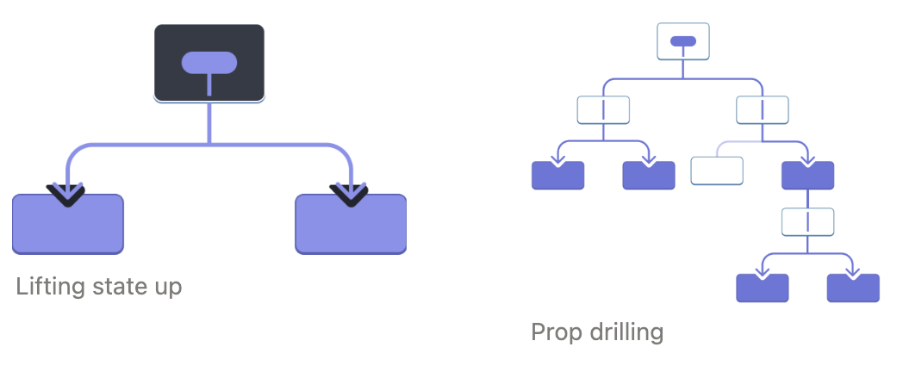
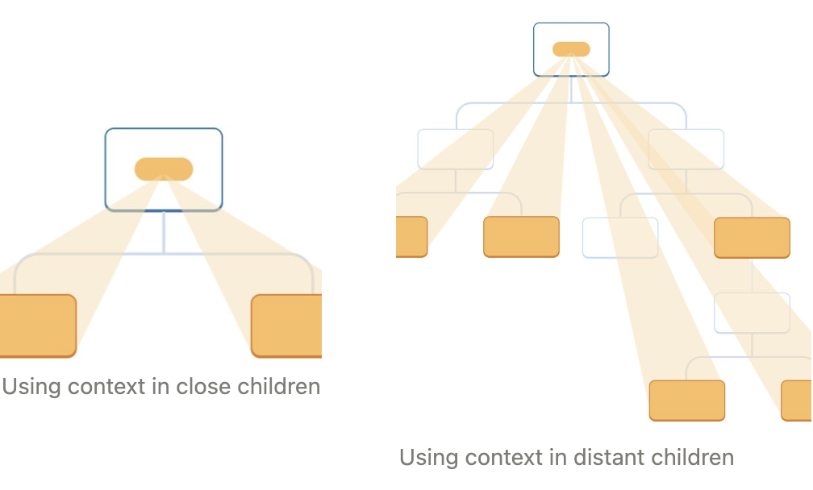

# 3-6. 컨텍스트로 데이터를 깊게 전달하기

일반적으로 부모 컴포넌트에서 자식 컴포넌트로 props를 통해 정보를 전달합니다. 하지만 중간에 여러 컴포넌트를 거쳐야 하거나 앱의 여러 컴포넌트가 동일한 정보를 필요로 하는 경우 props를 전달하면 장황하고 불편해질 수 있습니다. *컨텍스트*를 사용하면 부모 컴포넌트가 props를 통해 명시적으로 전달하지 않고도 그 아래 트리의 모든 컴포넌트에서 일부 정보를 사용할 수 있습니다(아무리 깊어도).

> **학습 내용**
>
> - “prop drilling’이란?
> - 반복적인 prop 전달을 컨텍스트로 대체하는 방법
> - 컨텍스트의 일반적인 사용 사례
> - 컨텍스트에 대한 일반적인 대안

## props 전달의 문제

[props 전달](https://www.notion.so/dc56004c6650462b9e98d49d7d387eff)은 UI 트리를 통해 데이터를 사용하는 컴포넌트로 명시적으로 연결할 수 있는 좋은 방법입니다.

그러나 트리 깊숙이 prop을 전달해야 하거나 많은 컴포넌트에 동일한 prop이 필요한 경우 prop 전달이 장황하고 불편해질 수 있습니다. 가장 가까운 공통 조상이 데이터가 필요한 컴포넌트에서 멀리 떨어져 있을 수 있으며, [state를 그렇게 높이 끌어올리면](https://www.notion.so/84873ee0bb1a4a92bdc4c355d12d765c) "prop 드릴링" 이라고 불리는 상황이 발생할 수 있습니다.



props를 전달하지 않고도 트리에서 데이터를 필요한 컴포넌트로 '텔레포트'할 수 있는 방법이 있다면 좋지 않을까요? React의 컨텍스트 기능을 사용하면 가능합니다!

## Context: props 전달의 대안

컨텍스트를 사용하면 상위 컴포넌트가 그 아래 전체 트리에 데이터를 제공할 수 있습니다. 컨텍스트는 다양한 용도로 사용됩니다. 다음은 한 가지 예시입니다. 크기에 대한 `level`을 받아들이는 `Heading`컴포넌트를 생각해 봅시다:

```javascript
import Heading from './Heading.js';
import Section from './Section.js';

export default function Page() {
  return (
    <Section>
      <Heading level={1}>Title</Heading>
      <Heading level={2}>Heading</Heading>
      <Heading level={3}>Sub-heading</Heading>
      <Heading level={4}>Sub-sub-heading</Heading>
      <Heading level={5}>Sub-sub-sub-heading</Heading>
      <Heading level={6}>Sub-sub-sub-sub-heading</Heading>
    </Section>
  );
}
```

```javascript
export default function Section({ children }) {
  return <section className='section'>{children}</section>;
}
```

```javascript
export default function Heading({ level, children }) {
  switch (level) {
    case 1:
      return <h1>{children}</h1>;
    case 2:
      return <h2>{children}</h2>;
    case 3:
      return <h3>{children}</h3>;
    case 4:
      return <h4>{children}</h4>;
    case 5:
      return <h5>{children}</h5>;
    case 6:
      return <h6>{children}</h6>;
    default:
      throw Error('Unknown level: ' + level);
  }
}
```

동일한 `Section` 내의 여러 제목이 항상 같은 크기를 갖도록 하려고 한다고 가정해 보겠습니다:

```javascript
import Heading from './Heading.js';
import Section from './Section.js';

export default function Page() {
  return (
    <Section>
      <Heading level={1}>Title</Heading>
      <Section>
        <Heading level={2}>Heading</Heading>
        <Heading level={2}>Heading</Heading>
        <Heading level={2}>Heading</Heading>
        <Section>
          <Heading level={3}>Sub-heading</Heading>
          <Heading level={3}>Sub-heading</Heading>
          <Heading level={3}>Sub-heading</Heading>
          <Section>
            <Heading level={4}>Sub-sub-heading</Heading>
            <Heading level={4}>Sub-sub-heading</Heading>
            <Heading level={4}>Sub-sub-heading</Heading>
          </Section>
        </Section>
      </Section>
    </Section>
  );
}
```

현재 `level` prop 을 각 `<Heading>`에 개별적으로 전달합니다:

```javascript
<Section>
  <Heading level={3}>About</Heading>
  <Heading level={3}>Photos</Heading>
  <Heading level={3}>Videos</Heading>
</Section>
```

대신 `level` prop 을 `<Section>` 컴포넌트로 전달하고 `<Heading>`에서 제거할 수 있다면 좋을 것입니다. 이렇게 하면 같은 섹션의 모든 제목이 같은 크기를 갖도록 강제할 수 있습니다:

```javascript
<Section level={3}>
  <Heading>About</Heading>
  <Heading>Photos</Heading>
  <Heading>Videos</Heading>
</Section>
```

하지만 `<Heading>` 컴포넌트가 가장 가까운 `<Section>`의 레벨을 어떻게 알 수 있을까요? **그러기 위해서는 자식이 트리 위 어딘가에서 데이터를 '요청'할 수 있는 방법이 필요합니다.**

props 만으로는 부족합니다. 이때 컨텍스트가 중요한 역할을 합니다. 세 단계로 진행합니다:

1.  컨텍스트를 **생성**합니다. (제목 레벨을 위한 것이므로 `LevelContext`라고 부를 수 있습니다.)
2.  데이터가 필요한 컴포넌트에서 해당 컨텍스트를 **사용**합니다. (`Heading`은 `LevelContext`를 사용합니다.)
3.  데이터를 지정하는 컴포넌트에서 해당 컨텍스트를 **제공**합니다. (`Section`은 `LevelContext`를 제공합니다).

컨텍스트는 멀리 떨어져 있는 상위 트리라도 그 안에 있는 전체 트리에 일부 데이터를 제공할 수 있게 해줍니다.



### Step 1: 컨텍스트 만들기

먼저 컨텍스트를 만들어야 합니다. 컴포넌트에서 사용할 수 있도록 파일에서 **내보내기**를해야 합니다:

```javascript
import { createContext } from 'react';

export const LevelContext = createContext(1);
```

`createContext`의 유일한 인수는 *기본값*입니다. 여기서 `1`은 가장 큰 제목 수준을 의미하지만 모든 종류의 값(객체 포함)을 전달할 수 있습니다. 기본값의 중요성은 다음 단계에서 확인할 수 있습니다.

### Step 2: 컨텍스트 사용

React와 컨텍스트에서 `useContext` Hook을 가져옵니다:

```javascript
import { useContext } from 'react';
import { LevelContext } from './LevelContext.js';
```

현재 `Heading` 컴포넌트는 props 에서 `level`을 읽습니다:

```javascript
export default function Heading({ level, children }) {
  // ...
}
```

대신 `level` prop을 제거하고 방금 import한 컨텍스트인 `LevelContext`에서 값을 읽습니다:

```javascript
export default function Heading({ children }) {
  const level = useContext(LevelContext);
  // ...
}
```

`useContext`는 Hook입니다. `useState` 및 `useReducer`와 마찬가지로, React 컴포넌트의 최상위 레벨에서만 Hook을 호출할 수 있습니다. **`useContext`는 React에게 `Heading` 컴포넌트가 `LevelContext`를 읽기를 원한다고 알려줍니다.**

이제 `Heading` 컴포넌트에는 `level` prop 이 없으므로 더 이상 JSX에서 이런 식으로 `Heading`에 레벨 prop 을 전달할 필요가 없습니다:

```javascript
<Section>
  <Heading level={4}>Sub-sub-heading</Heading>
  <Heading level={4}>Sub-sub-heading</Heading>
  <Heading level={4}>Sub-sub-heading</Heading>
</Section>
```

대신 JSX를 수신하는 `Section`이 되도록 JSX를 업데이트합니다:

다시 한 번 말씀드리지만, 이 마크업이 작동하도록 만들고자 했던 그 마크업입니다:

```javascript
import Heading from './Heading.js';
import Section from './Section.js';

export default function Page() {
  return (
    <Section level={1}>
      <Heading>Title</Heading>
      <Section level={2}>
        <Heading>Heading</Heading>
        <Heading>Heading</Heading>
        <Heading>Heading</Heading>
        <Section level={3}>
          <Heading>Sub-heading</Heading>
          <Heading>Sub-heading</Heading>
          <Heading>Sub-heading</Heading>
          <Section level={4}>
            <Heading>Sub-sub-heading</Heading>
            <Heading>Sub-sub-heading</Heading>
            <Heading>Sub-sub-heading</Heading>
          </Section>
        </Section>
      </Section>
    </Section>
  );
}
```

이 예제는 아직 제대로 작동하지 않습니다! **컨텍스트를 사용하고 있지만 아직 컨텍스트를 제공하지 않았기 때문에** 모든 제목의 크기가 동일합니다. React는 어디서 그것을 가져와야 할지 모릅니다!

컨텍스트를 제공하지 않으면 React는 이전 단계에서 지정한 기본값을 사용합니다. 이 예제에서는 `createContext`의 인수로 `1`을 지정했기 때문에, `useContext(LevelContext)`는 `1`을 반환하고 모든 제목을 `<h1>`으로 설정합니다. 각 `Section`이 자체 컨텍스트를 제공하도록 하여 이 문제를 해결해 보겠습니다.

### Step 3: 컨텍스트 제공

`Section` 컴포넌트는 현재 children을 렌더링합니다:

```javascript
export default function Section({ children }) {
  return <section className='section'>{children}</section>;
}
```

**context provider로 래핑하여** `LevelContext`를 제공하세요:

```javascript
import { LevelContext } from './LevelContext.js';

export default function Section({ level, children }) {
  return (
    <section className='section'>
      <LevelContext.Provider value={level}>{children}</LevelContext.Provider>
    </section>
  );
}
```

이는 React에게 "이 `<Section>` 안에 있는 컴포넌트가 `LevelContext`를 요청하면 이 `level`을 제공하라"고 지시합니다. 컴포넌트는 그 위에 있는 UI 트리에서 가장 가까운 `<LevelContext.Provider>`의 값을 사용합니다.

```javascript
import Heading from './Heading.js';
import Section from './Section.js';

export default function Page() {
  return (
    <Section level={1}>
      <Heading>Title</Heading>
      <Section level={2}>
        <Heading>Heading</Heading>
        <Heading>Heading</Heading>
        <Heading>Heading</Heading>
        <Section level={3}>
          <Heading>Sub-heading</Heading>
          <Heading>Sub-heading</Heading>
          <Heading>Sub-heading</Heading>
          <Section level={4}>
            <Heading>Sub-sub-heading</Heading>
            <Heading>Sub-sub-heading</Heading>
            <Heading>Sub-sub-heading</Heading>
          </Section>
        </Section>
      </Section>
    </Section>
  );
}
```

원래 코드와 동일한 결과이지만, 각 `Heading` 컴포넌트에 `level` prop을 전달할 필요가 없습니다! 대신, 위의 가장 가까운 `Section`에 요청하여 제목 수준을 "파악"합니다:

1.  `level` prop을 `<Section>`에 전달합니다.
2.  `Section` 은 이 children을 `<LevelContext.Provider value={level}>`로 래핑합니다.
3.  `Heading`은 `useContext(LevelContext)`를 사용하여 위의 `LevelContext`값에 가장 가까운 값을 묻습니다.

## 동일한 컴포넌트에서 컨텍스트 사용 및 제공

현재는 여전히 각 섹션의 레벨을 수동으로 지정해야 합니다:

```javascript
export default function Page() {
  return (
    <Section level={1}>
      ...
      <Section level={2}>
        ...
        <Section level={3}>
          ...
```

컨텍스트를 사용하면 위의 컴포넌트에서 정보를 읽을 수 있으므로 각 `Section`은 위의 `Section`에서 `level`을 읽고 `level + 1`을 자동으로 아래로 전달할 수 있습니다. 방법은 다음과 같습니다:

```javascript
import { useContext } from 'react';
import { LevelContext } from './LevelContext.js';

export default function Section({ children }) {
  const level = useContext(LevelContext);
  return (
    <section className='section'>
      <LevelContext.Provider value={level + 1}>
        {children}
      </LevelContext.Provider>
    </section>
  );
}
```

이렇게 변경하면 `level` prop을 `<Section>`이나 `<Heading>`에 전달할 필요가 없습니다:

```javascript
import Heading from './Heading.js';
import Section from './Section.js';

export default function Page() {
  return (
    <Section>
      <Heading>Title</Heading>
      <Section>
        <Heading>Heading</Heading>
        <Heading>Heading</Heading>
        <Heading>Heading</Heading>
        <Section>
          <Heading>Sub-heading</Heading>
          <Heading>Sub-heading</Heading>
          <Heading>Sub-heading</Heading>
          <Section>
            <Heading>Sub-sub-heading</Heading>
            <Heading>Sub-sub-heading</Heading>
            <Heading>Sub-sub-heading</Heading>
          </Section>
        </Section>
      </Section>
    </Section>
  );
}
```

이제 `Heading`과 `Section`은 모두 `LevelContext`를 읽어 얼마나 "깊은" 수준인지 파악합니다. 그리고 `Section`은 그 children을 `LevelContext`로 래핑하여 그 안에 있는 모든 것이 "더 깊은" 레벨에 있음을 지정합니다.

> **Note**  
> 이 예제에서는 중첩된 컴포넌트가 컨텍스트를 재정의하는 방법을 시각적으로 보여주기 위해 제목 수준을 사용합니다. 하지만 컨텍스트는 다른 많은 사용 사례에도 유용합니다. 컨텍스트를 사용하여 현재 색상 테마, 현재 로그인한 사용자 등 전체 하위 트리에 필요한 모든 정보를 전달할 수 있습니다.

## 컨텍스트는 중간 컴포넌트를 통과합니다.

컨텍스트를 제공하는 컴포넌트와 컨텍스트를 사용하는 컴포넌트 사이에 원하는 만큼의 컴포넌트를 삽입할 수 있습니다. 여기에는 `<div>`와 같은 기본 제공 컴포넌트와 사용자가 직접 빌드할 수 있는 컴포넌트가 모두 포함됩니다.

이 예시에서는 동일한 `Post` 컴포넌트(점선 테두리 포함)가 두 개의 서로 다른 중첩 레벨에서 렌더링됩니다. 그 안의 `<Heading>`이 가장 가까운 `<Section>`에서 자동으로 레벨을 가져오는 것을 볼 수 있습니다:

```javascript
import Heading from './Heading.js';
import Section from './Section.js';

export default function ProfilePage() {
  return (
    <Section>
      <Heading>My Profile</Heading>
      <Post title='Hello traveller!' body='Read about my adventures.' />
      <AllPosts />
    </Section>
  );
}

function AllPosts() {
  return (
    <Section>
      <Heading>Posts</Heading>
      <RecentPosts />
    </Section>
  );
}

function RecentPosts() {
  return (
    <Section>
      <Heading>Recent Posts</Heading>
      <Post title='Flavors of Lisbon' body='...those pastéis de nata!' />
      <Post title='Buenos Aires in the rhythm of tango' body='I loved it!' />
    </Section>
  );
}

function Post({ title, body }) {
  return (
    <Section isFancy={true}>
      <Heading>{title}</Heading>
      <p>
        <i>{body}</i>
      </p>
    </Section>
  );
}
```

이 기능이 작동하기 위해 특별한 작업을 수행하지 않았습니다. `Section`은 그 안에 있는 트리의 컨텍스트를 지정하므로 아무 곳에나 `<Heading>`을 삽입할 수 있으며 올바른 크기를 갖습니다.

**컨텍스트를 사용하면 "주변 환경에 적응"하고 렌더링되는 위치(즉 컨텍스트)에 따라 다르게 표시되는 컴포넌트를 작성할 수 있습니다.**

컨텍스트가 작동하는 방식은 [CSS 속성 상속](https://developer.mozilla.org/en-US/docs/Web/CSS/inheritance)을 떠올리게 할 수 있습니다. CSS에서는 `<div>`에 `color: blue`을 지정할 수 있으며, 중간에 다른 DOM 노드가 `color: green`으로 재정의하지 않는 한 그 안에 있는 모든 DOM 노드는 아무리 깊어도 그 색을 상속받습니다. 마찬가지로 React에서 위에서 오는 컨텍스트를 재정의하는 유일한 방법은 자식을 다른 값으로 컨텍스트 프로바이더로 감싸는 것입니다.

CSS에서는 `color` 및 `background-color`와 같은 서로 다른 속성이 서로 재정의되지 않습니다. `background-color`에 영향을 주지 않고 모든`<div>`의 `color`을 빨간색으로 설정할 수 있습니다. 마찬가지로 **서로 다른 React 컨텍스트도 서로 재정의하지 않습니다.** `createContext()`로 만드는 각 컨텍스트는 다른 컨텍스트와 완전히 분리되어 있으며, 특정 컨텍스트를 사용하거나 제공하는 컴포넌트를 함께 묶습니다. 하나의 컴포넌트가 문제없이 다양한 컨텍스트를 사용하거나 제공할 수 있습니다.

## 컨텍스트를 사용하기 전에

컨텍스트는 사용하기 매우 유혹적입니다! 그러나 이는 또한 너무 쉽게 남용될 수 있다는 의미이기도 합니다. **props를 몇 단계 깊이 전달해야 한다고 해서 해당 정보를 컨텍스트에 넣어야 한다는 의미는 아닙니다.**

다음은 컨텍스트을 사용하기 전에 고려해야 할 몇 가지 대안입니다:

1.  **[props 전달](https://www.notion.so/dc56004c6650462b9e98d49d7d387eff)로 시작하기.** 컴포넌트가 사소하지 않다면, 수십 개의 props를 수십 개의 컴포넌트에 전달해야 하는 경우가 드물지 않습니다. 지루하게 느껴질 수도 있지만, 어떤 컴포넌트가 어떤 데이터를 사용하는지 매우 명확해집니다! 코드를 유지 관리하는 사람은 프로퍼티를 사용하여 데이터 흐름을 명확하게 만든 것에 만족할 것입니다.
2.  **컴포넌트를 추출하고** [**JSX를 `children`으로 전달**](https://www.notion.so/dc56004c6650462b9e98d49d7d387eff)하세요. 일부 데이터를 해당 데이터를 사용하지 않는 중간 컴포넌트의 여러 레이어를 거쳐 전달한다면(그리고 더 아래로만 전달한다면), 이는 종종 그 과정에서 일부 컴포넌트를 추출하는 것을 잊었다는 것을 의미합니다. 예를 들어, `posts`과 같은 데이터 props를 직접 사용하지 않는 시각적 컴포넌트에 `<Layout posts={posts} />`. 대신, `Layout`이 `children`을 prop으로 사용하도록 만들고 `<Layout><Posts posts={posts} /></Layout>`를 렌더링합니다. 이렇게 하면 데이터를 지정하는 컴포넌트와 데이터를 필요로 하는 컴포넌트 사이의 레이어 수가 줄어듭니다.

이 두 가지 접근 방식이 모두 적합하지 않은 경우 컨텍스트를 고려하세요.

## 컨텍스트 사용 사례

- **테마**: 앱에서 사용자가 앱의 모양을 변경할 수 있는 경우(예: 다크 모드), 앱 상단에 컨텍스트 공급자를 배치하고 시각적 모양을 조정해야 하는 컴포넌트에서 해당 컨텍스트를 사용할 수 있습니다.
- **현재 계정**: 많은 컴포넌트에서 현재 로그인한 사용자를 알아야 할 수 있습니다. 이 정보를 컨텍스트에 넣으면 트리의 어느 곳에서나 편리하게 읽을 수 있습니다. 또한 일부 앱에서는 여러 계정을 동시에 조작할 수 있습니다(예: 다른 사용자로 댓글을 남기는 경우). 이러한 경우 UI의 일부를 다른 현재 계정 값으로 중첩된 공급자로 감싸는 것이 편리할 수 있습니다.
- **라우팅**: 대부분의 라우팅 솔루션은 내부적으로 컨텍스트를 사용하여 현재 경로를 유지합니다. 이것이 모든 링크가 활성 상태인지 아닌지를 "아는" 방식입니다. 자체 라우터를 구축하는 경우에도 이러한 방식을 사용할 수 있습니다.
- state **관리**: 앱이 성장함에 따라 앱 상단에 많은 state가 가까워질 수 있습니다. 아래에 있는 많은 멀리 떨어진 컴포넌트에서 이를 변경하고 싶을 수 있습니다. [컨텍스트와 함께 리듀서를 사용](https://www.notion.so/f3625eaf0ba446bf980b6d1f78ced553)하여 복잡한 state를 관리하고 번거로움 없이 멀리 떨어진 컴포넌트에 전달하는 것이 일반적입니다.

컨텍스트는 정적 값에만 국한되지 않습니다. 다음 렌더링에서 다른 값을 전달하면 React는 아래에서 이를 읽는 모든 컴포넌트를 업데이트합니다! 이것이 컨텍스트가 state와 함께 자주 사용되는 이유입니다.

일반적으로 트리의 다른 부분에 있는 멀리 떨어진 컴포넌트에서 일부 정보가 필요한 경우 컨텍스트가 도움이 될 수 있다는 좋은 신호입니다

## Recap

- 컨텍스트는 컴포넌트가 그 아래 전체 트리에 일부 정보를 제공할 수 있도록 합니다.
- 컨텍스트를 전달하려면
  1. `export const MyContext = createContext(defaultValue)`를 사용하여 컨텍스트를 생성하고 내보냅니다.
  2. `useContext(MyContext)` 훅에 전달하여 깊이에 상관없이 모든 하위 컴포넌트에서 읽을 수 있도록 합니다.
  3. 자식 컴포넌트를 `<MyContext.Provider value={...}>`로 감싸서 부모로부터 제공받습니다.
- 컨텍스트는 중간에 있는 모든 컴포넌트를 통과합니다.
- 컨텍스트를 사용하면 "주변 환경에 적응"하는 컴포넌트를 작성할 수 있습니다.
- 컨텍스트를 사용하기 전에 props를 전달하거나 JSX를 `children`으로 전달해 보세요.
