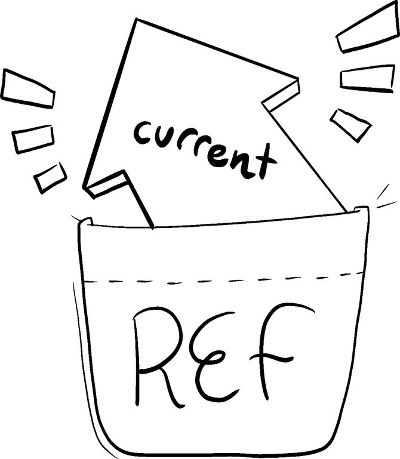

# 4-1. Ref로 값 참조하기

컴포넌트가 특정 정보를 '기억'하도록 하고 싶지만 해당 정보가 [새 렌더링을 트리거](https://www.notion.so/ecf4950ea19d485bbd5df75040dc59d4)하지 않도록 하려는 경우 ref를 사용할 수 있습니다.

> **학습 내용**
>
> - [컴포넌트에 ref를 추가하는 방법](#컴포넌트에-ref-추가하기)
> - [ref 값을 업데이트하는 방법](#example-스톱워치-만들기)
> - [state와 ref의 차이점](#ref와-state의-차이점)
> - [ref를 안전하게 사용하는 방법](#참조를-사용해야-하는-경우)

## 컴포넌트에 ref 추가하기

리액트에서 `useRef` Hook을 가져와서 컴포넌트에 ref를 추가할 수 있습니다:

```javascript
import { useRef } from 'react';
```

컴포넌트 내부에서 `useRef` Hook을 호출하고 참조할 초기값을 인자로 전달하십시오. 예를 들어,값 `0`은 ref에 대한 초기값입니다:

```javascript
const ref = useRef(0);
```

`useRef`는 다음과 같은 객체를 반환합니다:

```javascript
{
  current: 0; // The value you passed to useRef
}
```



`ref.current` 속성을 통해 해당 ref의 현재 값에 액세스할 수 있습니다. 이 값은 의도적으로 변경 가능하므로 읽기와 쓰기가 모두 가능합니다. React가 추적하지 않는 컴포넌트의 비밀 주머니와 같습니다. (이것이 바로 React의 단방향 데이터 흐름에서 "탈출구"가 되는 이유입니다. 아래에서 자세히 설명합니다!)

여기서 버튼은 클릭할 때마다 `ref.current`를 증가시킵니다:

```javascript
import { useRef } from 'react';

export default function Counter() {
  let ref = useRef(0);

  function handleClick() {
    ref.current = ref.current + 1;
    alert('You clicked ' + ref.current + ' times!');
  }

  return <button onClick={handleClick}>Click me!</button>;
}
```

여기서의 ref는 숫자를 가리키고 있지만, [state](https://www.notion.so/2b87b53046e14485883b0bf8036311f6)와 마찬가지로 문자열, 객체, 함수 등 무엇이든 가리킬 수 있습니다. state와 달리 ref는 `current` 속성을 읽고 수정할 수 있는 일반 JavaScript 객체입니다.

**컴포넌트는 ref가 증가할 때마다 리렌더링되지 않는다**는 점에 유의하세요. state와 마찬가지로 ref는 리렌더링 사이에 React에 의해 유지됩니다. state를 설정하면 컴포넌트가 다시 렌더링됩니다. 반면 ref를 변경하면 그렇지 않습니다!

## Example: 스톱워치 만들기

ref와 state를 단일 컴포넌트로 결합할 수 있습니다. 예를 들어 사용자가 버튼을 눌러 시작하거나 중지할 수 있는 스톱워치를 만들어 봅시다. 사용자가 'Start'를 누른 후 얼마나 시간이 지났는지 표시하려면 시작 버튼을 누른 시점과 현재 시간을 추적해야 합니다. **이 정보는 렌더링에 사용되므로 state를 유지해야 합니다:**

```javascript
const [startTime, setStartTime] = useState(null);
const [now, setNow] = useState(null);
```

사용자가 'Start'를 누르면 10 milliseconds마다 시간을 업데이트하기 위해 [setInterval](https://developer.mozilla.org/docs/Web/API/setInterval) 을 사용하게 됩니다:

```javascript
import { useState } from 'react';

export default function Stopwatch() {
  const [startTime, setStartTime] = useState(null);
  const [now, setNow] = useState(null);

  function handleStart() {
    // Start counting.
    setStartTime(Date.now());
    setNow(Date.now());

    setInterval(() => {
      // Update the current time every 10ms.
      setNow(Date.now());
    }, 10);
  }

  let secondsPassed = 0;
  if (startTime != null && now != null) {
    secondsPassed = (now - startTime) / 1000;
  }

  return (
    <>
      <h1>Time passed: {secondsPassed.toFixed(3)}</h1>
      <button onClick={handleStart}>Start</button>
    </>
  );
}
```

"Stop" 버튼을 누르면 `now` state 변수의 업데이트를 중지하도록 기존 간격을 취소해야 합니다. 이 작업은 `[clearInterval](https://developer.mozilla.org/en-US/docs/Web/API/clearInterval)` 을 호출하여 수행할 수 있지만, 사용자가 시작을 눌렀을 때 이전에 `setInterval` 호출에서 반환한 interval ID를 제공해야 합니다. interval ID를 어딘가에 보관해야 합니다. **interval ID는 렌더링에 사용되지 않으므로 ref에 보관할 수 있습니다**

```javascript
import { useState, useRef } from 'react';

export default function Stopwatch() {
  const [startTime, setStartTime] = useState(null);
  const [now, setNow] = useState(null);
  const intervalRef = useRef(null);

  function handleStart() {
    setStartTime(Date.now());
    setNow(Date.now());

    clearInterval(intervalRef.current);
    intervalRef.current = setInterval(() => {
      setNow(Date.now());
    }, 10);
  }

  function handleStop() {
    clearInterval(intervalRef.current);
  }

  let secondsPassed = 0;
  if (startTime != null && now != null) {
    secondsPassed = (now - startTime) / 1000;
  }

  return (
    <>
      <h1>Time passed: {secondsPassed.toFixed(3)}</h1>
      <button onClick={handleStart}>Start</button>
      <button onClick={handleStop}>Stop</button>
    </>
  );
}
```

렌더링에 정보가 사용되는 경우 해당 정보를 state로 유지하세요. 이벤트 핸들러만 정보를 필요로 하고 변경해도 다시 렌더링할 필요가 없는 경우, ref를 사용하는 것이 더 효율적일 수 있습니다.

## ref와 state의 차이점

어쩌면 항상 state 설정자 함수를 사용하지 않고도 변이할 수 있기 때문에 ref가 state보다 덜 “strict”하다고 생각할 수 있습니다. 그러나 대부분의 경우 state를 사용하길 원할 것입니다. ref는 자주 사용하지 않는 "탈출구"입니다. state와 ref를 비교하면 다음과 같습니다:

### ref

- `useRef(initialValue)` returns `{ current: initialValue }`
- 변경 시 리렌더링이 트리거되지 않습니다.
- Mutable : 렌더링 프로세스 외부에서 `current` 값을 수정하고 업데이트할 수 있습니다.
- 렌더링 중에는 `current` 값을 읽거나 쓰지 않아야 합니다.

### state

- `useState(initialValue)`는 state 변수의 현재 값과 state 설정자 함수(`[value, setValue]`)를 반환합니다.
- 변경 시 리렌더링을 트리거합니다.
- Immutable : state setting 함수를 사용하여 state 변수를 수정해 리렌더링을 대기열에 추가해야 합니다.
- 언제든지 state를 읽을 수 있습니다. 그러나 각 렌더링에는 변경되지 않는 자체 state [snapshot](https://react.dev/learn/state-as-a-snapshot)이 있습니다.

다음은 state와 함께 구현된 카운터 버튼입니다:

```javascript
import { useState } from 'react';

export default function Counter() {
  const [count, setCount] = useState(0);

  function handleClick() {
    setCount(count + 1);
  }

  return <button onClick={handleClick}>You clicked {count} times</button>;
}
```

`count` 값이 표시되므로 state 값을 사용하는 것이 합리적입니다. 카운터 값이 `setCount()`로 설정되면 React는 컴포넌트를 다시 렌더링하고 화면이 새로운 카운트를 반영하도록 업데이트합니다.

만약 이것을 ref로 구현하려고 한다면, React는 컴포넌트를 다시 렌더링하지 않으므로 카운트가 변경되는 것을 볼 수 없을 것입니다! 이 버튼을 클릭해도 **텍스트가 업데이트되지 않는 방법**을 확인하세요:

```javascript
import { useRef } from 'react';

export default function Counter() {
  let countRef = useRef(0);

  function handleClick() {
    // This doesn't re-render the component!
    countRef.current = countRef.current + 1;
  }

  return (
    <button onClick={handleClick}>You clicked {countRef.current} times</button>
  );
}
```

렌더링 중에 `ref.current` 를 읽으면 코드가 불안정해지는 이유입니다. 필요하다면 state를 대신 사용하세요.

> **[DEEP DIVE] useRef는 내부에서 어떻게 작동하나요?**  
> useState와 useRef는 모두 React에서 제공하지만, 원칙적으로 useRef는 useState 위에 구현될 수 있습니다. React 내부에서 useRef는 다음과 같이 구현된다고 상상할 수 있습니다
>
> ```javascript
> // Inside of React
> function useRef(initialValue) {
>   const [ref, unused] = useState({ current: initialValue });
>   return ref;
> }
> ```
>
> 첫 번째 렌더링 중에 `useRef` 는 `{ current: initialValue }`를 반환합니다. 이 객체는 React에 의해 저장되므로 다음 렌더링 중에 동일한 객체가 반환됩니다. 이 예제에서 state setter가 어떻게 사용되지 않는지 주목하세요. useRef는 항상 동일한 객체를 반환해야 하기 때문에 불필요합니다!  
> React는 충분히 일반적인 상황이라 판단하고 내장된 버전의 `useRef`를 제공합니다. ref를 설정자가 없는 일반 state 변수라고 생각하면 됩니다. 객체지향 프로그래밍에 익숙하다면 인스턴스 필드를 떠올릴 수 있는데, `this.something` 대신 `somethingRef.current`를 사용하면 됩니다.

## 참조를 사용해야 하는 경우

일반적으로 ref는 컴포넌트가 React로부터 "한 발 밖으로 나와서" 컴포넌트의 형상에 영향을 주지 않는 외부 API(브라우저 API 등)과 통신해야 할 때 사용합니다. 다음은 이러한 상황 중 일부입니다:

- [timeout ID](https://developer.mozilla.org/docs/Web/API/setTimeout) 저장
- [다음 페이지](https://www.notion.so/dc08e3777cf84bcabb3d07e669552420)에서 다룰 [DOM elements](https://developer.mozilla.org/docs/Web/API/Element) 저장 및 조작하기
- JSX를 계산하는 데 필요하지 않은 다른 객체를 저장하는 경우.

컴포넌트에 일부 값을 저장해야 하지만 렌더링 로직에는 영향을 미치지 않는 경우 ref를 선택하세요.

## ref 모범 사례

다음 원칙을 따르면 컴포넌트의 예측 가능성을 높일 수 있습니다:

- **ref를 탈출구로 취급하세요**. ref는 외부 시스템이나 브라우저 API로 작업할 때 유용합니다. 애플리케이션 로직과 데이터 흐름의 대부분이 ref에 의존하는 경우 접근법을 다시 생각해보세요
- **렌더링 중에는 `ref.current`를 읽거나 쓰지 마세요.** 렌더링 중에 일부 정보가 필요하다면 [state](https://www.notion.so/2b87b53046e14485883b0bf8036311f6)를 대신 사용하세요. React는 `ref.current`가 언제 변경되는지 모르기 때문에 렌더링 중에 읽어도 컴포넌트의 동작을 예측하기 어렵습니다. (유일한 예외는 첫 번째 렌더링 중에 ref를 한 번만 설정하는 `if (!ref.current) ref.current = new Thing()`과 같은 코드입니다).

React state의 제한은 ref에는 적용되지 않습니다. 예를 들어 state는 [모든 렌더링에 대해 스냅샷](https://www.notion.so/58da923a84be4ffc8055b113ee1819bc)처럼 작동하며 [동기적으로 업데이트](https://www.notion.so/bdd4397a90f34416b9bb8dbbb43d74ef)되지 않습니다. 하지만 ref의 현재 값을 변이하면 즉시 변경됩니다:

```javascript
ref.current = 5;
console.log(ref.current); // 5
```

이는 ref 자체가 일반 자바스크립트 객체이므로 자바스크립트 객체처럼 동작하기 때문입니다.

또한 ref로 작업할 때 [변이(mutation)를 피하는 것](https://www.notion.so/0e53369c778347cbbd50845045d3028a)에 대해 걱정할 필요가 없습니다. 변이하는 객체가 렌더링에 사용되지 않는 한, React는 ref나 그 콘텐츠로 무엇을 하든 상관하지 않습니다.

## Ref와 DOM

ref는 모든 값을 가리킬 수 있습니다. 그러나 ref의 가장 일반적인 사용 사례는 DOM 요소에 액세스하는 것입니다. 예를 들어 프로그래밍 방식으로 input에 focus를 맞추고자 할 때 유용합니다. `<div ref={myRef}>`와 같이 JSX의 `ref` 어트리뷰트에 ref를 전달하면 React는 해당 DOM 엘리먼트를 `myRef.current`에 넣습니다. 이에 대한 자세한 내용은 [Manipulating the DOM with Refs](https://www.notion.so/dc08e3777cf84bcabb3d07e669552420)에서 확인할 수 있습니다.

## Recap

- Ref는 렌더링에 사용되지 않는 값을 유지하기 위한 탈출구입니다. 자주 필요하지 않습니다.
- ref는 `current`라는 단일 프로퍼티를 가진 일반 자바스크립트 객체로, 읽거나 설정할 수 있습니다.
- `useRef` Hook을 호출하여 React에 ref를 제공하도록 요청할 수 있습니다.
- state와 마찬가지로 ref를 사용하면 컴포넌트의 리렌더링 사이에 정보를 유지할 수 있습니다.
- state와 달리 ref의 `current` 값을 설정해도 리렌더링이 트리거되지 않습니다.
- 렌더링 중에는 `ref.current`를 읽거나 쓰지 마세요. 이렇게 하면 컴포넌트를 예측하기 어렵습니다.
